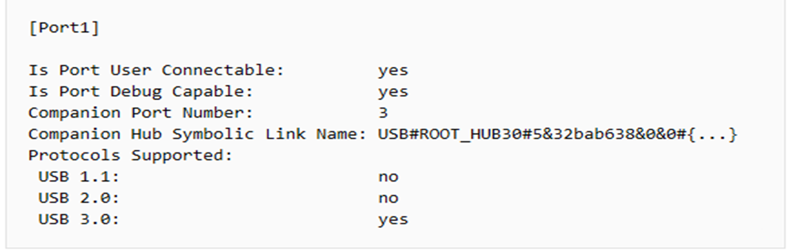

# Windbg 


## 环境搭建

#### 共同操作：下载并安装windbg

[下载windbg](https://aka.ms/windbg/download)

为windbg 设置 symbol 系统环境变量：

```
变量名：_NT_SYMBOL_PATH
变量值：d:Symbols;SRV*d:\Symbols*http://msdl.microsoft.com/download/symbols
```


### windbg pipe 管道链接虚拟机：

##### 虚拟机端设置：使用端口1会时常发生无法链接上问题，所以我使用的是端口2，做如下设置并关闭Secureboot 安全启动：


虚拟机开启在管理员权限下运行如下cmd命令开启测试模式：

```
bcdedit /set test signing on
```

win+r快捷键打开运行键入msconfig,做如下设置：


关机重启后虚拟机端设置完毕。

打开windbg -》文件-》Attach to kernel做如下设置：


点击OK按钮，链接成功。

### windbg usb3 链接实体机器：

•目标机器在bios setup中disable secure boot;

•用usb view 查看usb xhci 控制器的信息



•用usb view 查看所使用的usb口所在的主控芯片的bus,device,function号：如下图为B:0,D:20,F:0.


测试机管理员运行如下cmd  注：TargetName 修改为自己想要的名称:

```
bcdedit /debug on
bcdedit /dbgsettings usb targetname:TargetName 
bcdedit /set "{dbgsettings}" busparams b.d.f //usb view 查看所使用的usb口所在的主控芯片的bus,device,function号
```


### windbg lan 链接实体机器：

•Disable **secure boot** 

•测试机和目标机器必须处于同一网段

```
Hostip:192.168.0.100
Targetip:192.168.0.102
Recommend Port range :50000-50039 
```

•Closewindows Defender Firewall

测试机管理员权限运行如下命令：

```
bcdedit /debug on
bcdedit /set "{dbgsettings}" busparams b.d.f
BCDEDIT /dbgsettings net hostip:192.168.1.100 port:50001
```
