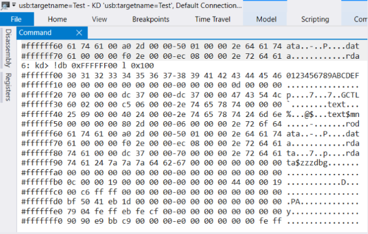
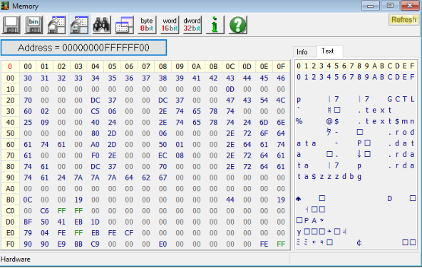

# WinDBG访问硬件

对于 X86 来说，访问硬件信息需要的基本操作有：

1. 1. PCI 信息的访问
   2. 访问IO Port 直接访问
   3. IO Port Index/Data 方式的访问
   4. Memory 的访问
   5. Memory Index/Data 方式的访问
   6. MSR 的访问

   

掌握了上述的访问方法就可以访问到 X86 上的全部空间和寄存器。下面逐项介绍在 WinDBG 中的访问方法。因为大多数情况下，WinDBG 是用于调试 Windows 软件本身而不是硬件，因此很多操作都是来自个人总结如果有错误或者遗漏，恳请及时指出。

#### 1.PCI的访问

a. !pcitree 命令可以用来查看当前系统中的PCI总线和设备信息【参考1】

实例如下

```

0: kd> !pcitree
SYMSRV:  BYINDEX: 0x5
         C:\ProgramData\Dbg\sym
         pci.pdb
         96732E11A7284081C982C9A015D949A81
SYMSRV:  UNC: C:\ProgramData\Dbg\sym\pci.pdb\96732E11A7284081C982C9A015D949A81\pci.pdb - path not found
SYMSRV:  UNC: C:\ProgramData\Dbg\sym\pci.pdb\96732E11A7284081C982C9A015D949A81\pci.pd_ - path not found
SYMSRV:  UNC: C:\ProgramData\Dbg\sym\pci.pdb\96732E11A7284081C982C9A015D949A81\file.ptr - path not found
SYMSRV:  RESULT: 0x80070003
SYMSRV:  BYINDEX: 0x6
         C:\ProgramData\Dbg\sym*https://msdl.microsoft.com/download/symbols
         pci.pdb
         96732E11A7284081C982C9A015D949A81
SYMSRV:  UNC: C:\ProgramData\Dbg\sym\pci.pdb\96732E11A7284081C982C9A015D949A81\pci.pdb - path not found
SYMSRV:  UNC: C:\ProgramData\Dbg\sym\pci.pdb\96732E11A7284081C982C9A015D949A81\pci.pd_ - path not found
SYMSRV:  UNC: C:\ProgramData\Dbg\sym\pci.pdb\96732E11A7284081C982C9A015D949A81\file.ptr - path not found
SYMSRV:  HTTPGET: /download/symbols/pci.pdb/96732E11A7284081C982C9A015D949A81/pci.pdb
SYMSRV:  HttpQueryInfo: 801900c8 - HTTP_STATUS_OK
SYMSRV:  pci.pdb from https://msdl.microsoft.com/download/symbols:copied      
SYMSRV:  PATH: C:\ProgramData\Dbg\sym\pci.pdb\96732E11A7284081C982C9A015D949A81\pci.pdb
SYMSRV:  RESULT: 0x00000000
DBGHELP: C:\ProgramData\Dbg\sym\pci.pdb\96732E11A7284081C982C9A015D949A81\pci.pdb cached to C:\ProgramData\Dbg\sym\pci.pdb\96732E11A7284081C982C9A015D949A81\pci.pdb
DBGHELP: pci - public symbols  
        C:\ProgramData\Dbg\sym\pci.pdb\96732E11A7284081C982C9A015D949A81\pci.pdb
Bus 0x0 (FDO Ext ffffb106414d5a20)
  (d=0,  f=0) 80863e34 devext 0xffffb1063bfef1b0 devstack 0xffffb1063bfef060 0600 Bridge/HOST to PCI
  (d=2,  f=0) 80863ea0 devext 0xffffb1063bfee1b0 devstack 0xffffb1063bfee060 0300 Display Controller/VGA
  (d=8,  f=0) 80861911 devext 0xffffb1063bfed1b0 devstack 0xffffb1063bfed060 0880 Base System Device/'Other' base system device
  (d=12, f=0) 80869df9 devext 0xffffb1063bfec1b0 devstack 0xffffb1063bfec060 1180 Unknown Base Class/Unknown Sub Class
  (d=13, f=0) 80869dfc devext 0xffffb1063bfeb1b0 devstack 0xffffb1063bfeb060 0700 Simple Serial Communications Controller/Serial Port
  (d=14, f=0) 80869ded devext 0xffffb1063bfea1b0 devstack 0xffffb1063bfea060 0c03 Serial Bus Controller/USB
  (d=14, f=2) 80869def devext 0xffffb1063bfe91b0 devstack 0xffffb1063bfe9060 0500 Memory Controller/RAM
  (d=15, f=0) 80869de8 devext 0xffffb1063b4751b0 devstack 0xffffb1063b475060 0c80 Serial Bus Controller/Unknown Sub Class
  (d=16, f=0) 80869de0 devext 0xffffb1063b4671b0 devstack 0xffffb1063b467060 0780 Simple Serial Communications Controller/'Other'
  (d=1d, f=0) 80869db0 devext 0xffffb1063b4691b0 devstack 0xffffb1063b469060 0604 Bridge/PCI to PCI
  Bus 0x1 (FDO Ext ffffb106414e1a20)
    (d=0,  f=0) 144da802 devext 0xffffb106415d81b0 devstack 0xffffb106415d8060 0108 Mass Storage Controller/Unknown Sub Class
  (d=1f, f=0) 80869d84 devext 0xffffb1063b47b740 devstack 0xffffb1063b47b5f0 0601 Bridge/PCI to ISA
  (d=1f, f=3) 80869dc8 devext 0xffffb106414d01b0 devstack 0xffffb106414d0060 0401 Multimedia Device/Audio
  (d=1f, f=4) 80869da3 devext 0xffffb106415c21b0 devstack 0xffffb106415c2060 0c05 Serial Bus Controller/Unknown Sub Class
  (d=1f, f=5) 80869da4 devext 0xffffb106415c91b0 devstack 0xffffb106415c9060 0c80 Serial Bus Controller/Unknown Sub Class
Total PCI Root busses processed = 1
Total PCI Segments processed = 1
```

如果运行时出现类似下面的提示，需要使用.reload pci.sys 加载一下对应的 symbol

```
0: kd> !pcitree
Error retrieving address of PciFdoExtensionListHead
```

b. !pci 命令，参数比较多，这里直接给出常用的命令【参考2】

!pci 2 ff //列出当前系统中全部 PCI 设备

```
0: kd> !pci 2 ff  
PCI Segment 0 Bus 0
00:0  8086:3e34.0b  Cmd[0006:.mb...]  Sts[0090:c....]  Intel Host Bridge  SubID:8086:7270
02:0  8086:3ea0.00  Cmd[0400:......]  Sts[0010:c....]  Intel VGA Compatible Controller  SubID:8086:2212
08:0  8086:1911.00  Cmd[0000:......]  Sts[0010:c....]  Intel Other System Peripheral  SubID:8086:7270
12:0  8086:9df9.30  Cmd[0002:.m....]  Sts[0010:c....]  Intel Other Signal Processing Controller  SubID:8086:7270
13:0  8086:9dfc.30  Cmd[0000:......]  Sts[0010:c....]  Intel Serial Controller  SubID:8086:7270
14:0  8086:9ded.30  Cmd[0406:.mb...]  Sts[0290:c....]  Intel Class:c:3:30  SubID:8086:7270
14:2  8086:9def.30  Cmd[0006:.mb...]  Sts[0010:c....]  Intel RAM Controller
15:0  8086:9de8.30  Cmd[0400:......]  Sts[0010:c....]  Intel Class:c:80:0  SubID:8086:7270
16:0  8086:9de0.30  Cmd[0406:.mb...]  Sts[0010:c....]  Intel Other Communications Controller  SubID:8086:7270
1d:0  8086:9db0.f0  Cmd[0407:imb...]  Sts[0010:c....]  Intel PCI-PCI Bridge 0->0x1-0x1
1f:0  8086:9d84.30  Cmd[0407:imb...]  Sts[0000:.....]  Intel ISA Bridge  SubID:8086:7270
1f:3  8086:9dc8.30  Cmd[0406:.mb...]  Sts[0010:c....]  Intel Audio Device  SubID:8086:7270
1f:4  8086:9da3.30  Cmd[0000:......]  Sts[0280:.....]  Intel SMBus Controller  SubID:8086:7270
1f:5  8086:9da4.30  Cmd[0402:.m....]  Sts[0000:.....]  Intel Class:c:80:0  SubID:8086:7270
PCI Segment 0 Bus 0x1
00:0  144d:a802.01  Cmd[0406:.mb...]  Sts[0010:c....]  Class:1:8:2  SubID:144d:a801
```

!pci f 0 2 0 0 0x200 //查看Bus 0, Device 2,function 0 上从 0 到 0x200的寄存器

```
0: kd> !pci f 0 2 0 0 0x200
PCI Segment 0 Bus 0
02:0  8086:3ea0.00  Cmd[0400:......]  Sts[0010:c....]  Intel VGA Compatible Controller  SubID:8086:2212
      cf8:80001000  IntPin:1  IntLine:0  Rom:0  cis:0  cap:40
      MEM[0]:cf000004  MPF[2]:d000000c  IO[4]:ffc1       
      00000000:  3ea08086 00100400 03000000 00000000
      00000010:  cf000004 00000000 d000000c 00000000
      00000020:  0000ffc1 00000000 00000000 22128086
      00000030:  00000000 00000040 00000000 00000100
      00000040:  010c7009 7a6160b1 9615808c 00000000
      00000050:  000001c1 00008031 00000000 8e000001
      00000060:  00010000 00000000 00000000 00000000
      00000070:  0092ac10 10008000 00000000 00000000
      00000080:  00000000 00000000 00000000 00000000
      00000090:  00000000 00000000 00000000 00000000
      000000a0:  00000000 00000000 00000000 0000d005
      000000b0:  fee00358 00000000 00000000 00000000
      000000c0:  00000000 00000000 00000000 00000000
      000000d0:  00220001 00000003 00000000 00000000
      000000e0:  00000000 00000000 00008000 00000000
      000000f0:  00000000 00000000 00000000 8cb33018
      00000100:  2001001b 00001400 00000000 00000000
      00000110:  00000000 00000000 00000000 00000000
      00000120:  00000000 00000000 00000000 00000000
      00000130:  00000000 00000000 00000000 00000000
      00000140:  00000000 00000000 00000000 00000000
      00000150:  00000000 00000000 00000000 00000000
      00000160:  00000000 00000000 00000000 00000000
      00000170:  00000000 00000000 00000000 00000000
      00000180:  00000000 00000000 00000000 00000000
      00000190:  00000000 00000000 00000000 00000000
      000001a0:  00000000 00000000 00000000 00000000
      000001b0:  00000000 00000000 00000000 00000000
      000001c0:  00000000 00000000 00000000 00000000
      000001d0:  00000000 00000000 00000000 00000000
      000001e0:  00000000 00000000 00000000 00000000
      000001f0:  00000000 00000000 00000000 00000000
      00000200:  0001000f
```

#### IO Port 的访问

| Function      | Command    | Description / mnemonic                    |
| ------------- | ---------- | ----------------------------------------- |
| Read IO port  | ib, iw, id | Input from port (byte, word, double word) |
| Write IO port | ob, ow, od | Output to port (byte, word, double word)  |

# 硬件

前面对于 RU.EFI 的研究告诉我们对于 X86 来说，访问硬件信息需要的基本操作有：

1. PCI 信息的访问
2. 访问IO Port 直接访问
3. IO Port Index/Data 方式的访问
4. Memory 的访问
5. Memory Index/Data 方式的访问
6. MSR 的访问

掌握了上述的访问方法就可以访问到 X86 上的全部空间和寄存器。下面逐项介绍在 WinDBG 中的访问方法。因为大多数情况下，WinDBG 是用于调试 Windows 软件本身而不是硬件，因此很多操作都是来自个人总结如果有错误或者遗漏，恳请及时指出。

1.PCI的访问

a. !pcitree 命令可以用来查看当前系统中的PCI总线和设备信息【参考1】

实例如下

```
0: kd> !pcitree``SYMSRV: BYINDEX: 0x5``     ``C:\ProgramData\Dbg\sym``     ``pci.pdb``     ``96732E11A7284081C982C9A015D949A81``SYMSRV: UNC: C:\ProgramData\Dbg\sym\pci.pdb\96732E11A7284081C982C9A015D949A81\pci.pdb - path not found``SYMSRV: UNC: C:\ProgramData\Dbg\sym\pci.pdb\96732E11A7284081C982C9A015D949A81\pci.pd_ - path not found``SYMSRV: UNC: C:\ProgramData\Dbg\sym\pci.pdb\96732E11A7284081C982C9A015D949A81\file.ptr - path not found``SYMSRV: RESULT: 0x80070003``SYMSRV: BYINDEX: 0x6``     ``C:\ProgramData\Dbg\sym*https://msdl.microsoft.com/download/symbols``     ``pci.pdb``     ``96732E11A7284081C982C9A015D949A81``SYMSRV: UNC: C:\ProgramData\Dbg\sym\pci.pdb\96732E11A7284081C982C9A015D949A81\pci.pdb - path not found``SYMSRV: UNC: C:\ProgramData\Dbg\sym\pci.pdb\96732E11A7284081C982C9A015D949A81\pci.pd_ - path not found``SYMSRV: UNC: C:\ProgramData\Dbg\sym\pci.pdb\96732E11A7284081C982C9A015D949A81\file.ptr - path not found``SYMSRV: HTTPGET: /download/symbols/pci.pdb/96732E11A7284081C982C9A015D949A81/pci.pdb``SYMSRV: HttpQueryInfo: 801900c8 - HTTP_STATUS_OK``SYMSRV: pci.pdb from https://msdl.microsoft.com/download/symbols:copied   ``SYMSRV: PATH: C:\ProgramData\Dbg\sym\pci.pdb\96732E11A7284081C982C9A015D949A81\pci.pdb``SYMSRV: RESULT: 0x00000000``DBGHELP: C:\ProgramData\Dbg\sym\pci.pdb\96732E11A7284081C982C9A015D949A81\pci.pdb cached to C:\ProgramData\Dbg\sym\pci.pdb\96732E11A7284081C982C9A015D949A81\pci.pdb``DBGHELP: pci - public symbols ``    ``C:\ProgramData\Dbg\sym\pci.pdb\96732E11A7284081C982C9A015D949A81\pci.pdb``Bus 0x0 (FDO Ext ffffb106414d5a20)`` ``(d=0, f=0) 80863e34 devext 0xffffb1063bfef1b0 devstack 0xffffb1063bfef060 0600 Bridge/HOST to PCI`` ``(d=2, f=0) 80863ea0 devext 0xffffb1063bfee1b0 devstack 0xffffb1063bfee060 0300 Display Controller/VGA`` ``(d=8, f=0) 80861911 devext 0xffffb1063bfed1b0 devstack 0xffffb1063bfed060 0880 Base System Device/'Other' base system device`` ``(d=12, f=0) 80869df9 devext 0xffffb1063bfec1b0 devstack 0xffffb1063bfec060 1180 Unknown Base Class/Unknown Sub Class`` ``(d=13, f=0) 80869dfc devext 0xffffb1063bfeb1b0 devstack 0xffffb1063bfeb060 0700 Simple Serial Communications Controller/Serial Port`` ``(d=14, f=0) 80869ded devext 0xffffb1063bfea1b0 devstack 0xffffb1063bfea060 0c03 Serial Bus Controller/USB`` ``(d=14, f=2) 80869def devext 0xffffb1063bfe91b0 devstack 0xffffb1063bfe9060 0500 Memory Controller/RAM`` ``(d=15, f=0) 80869de8 devext 0xffffb1063b4751b0 devstack 0xffffb1063b475060 0c80 Serial Bus Controller/Unknown Sub Class`` ``(d=16, f=0) 80869de0 devext 0xffffb1063b4671b0 devstack 0xffffb1063b467060 0780 Simple Serial Communications Controller/'Other'`` ``(d=1d, f=0) 80869db0 devext 0xffffb1063b4691b0 devstack 0xffffb1063b469060 0604 Bridge/PCI to PCI`` ``Bus 0x1 (FDO Ext ffffb106414e1a20)``  ``(d=0, f=0) 144da802 devext 0xffffb106415d81b0 devstack 0xffffb106415d8060 0108 Mass Storage Controller/Unknown Sub Class`` ``(d=1f, f=0) 80869d84 devext 0xffffb1063b47b740 devstack 0xffffb1063b47b5f0 0601 Bridge/PCI to ISA`` ``(d=1f, f=3) 80869dc8 devext 0xffffb106414d01b0 devstack 0xffffb106414d0060 0401 Multimedia Device/Audio`` ``(d=1f, f=4) 80869da3 devext 0xffffb106415c21b0 devstack 0xffffb106415c2060 0c05 Serial Bus Controller/Unknown Sub Class`` ``(d=1f, f=5) 80869da4 devext 0xffffb106415c91b0 devstack 0xffffb106415c9060 0c80 Serial Bus Controller/Unknown Sub Class``Total PCI Root busses processed = 1``Total PCI Segments processed = 1
如果运行时出现类似下面的提示，需要使用.reload pci.sys 加载一下对应的 symbol
0: kd> !pcitree``Error retrieving address of PciFdoExtensionListHead
```

b. !pci 命令，参数比较多，这里直接给出常用的命令【参考2】

!pci 2 ff //列出当前系统中全部 PCI 设备

```
0: kd> !pci 2 ff ``PCI Segment 0 Bus 0``00:0 8086:3e34.0b Cmd[0006:.mb...] Sts[0090:c....] Intel Host Bridge SubID:8086:7270``02:0 8086:3ea0.00 Cmd[0400:......] Sts[0010:c....] Intel VGA Compatible Controller SubID:8086:2212``08:0 8086:1911.00 Cmd[0000:......] Sts[0010:c....] Intel Other System Peripheral SubID:8086:7270``12:0 8086:9df9.30 Cmd[0002:.m....] Sts[0010:c....] Intel Other Signal Processing Controller SubID:8086:7270``13:0 8086:9dfc.30 Cmd[0000:......] Sts[0010:c....] Intel Serial Controller SubID:8086:7270``14:0 8086:9ded.30 Cmd[0406:.mb...] Sts[0290:c....] Intel Class:c:3:30 SubID:8086:7270``14:2 8086:9def.30 Cmd[0006:.mb...] Sts[0010:c....] Intel RAM Controller``15:0 8086:9de8.30 Cmd[0400:......] Sts[0010:c....] Intel Class:c:80:0 SubID:8086:7270``16:0 8086:9de0.30 Cmd[0406:.mb...] Sts[0010:c....] Intel Other Communications Controller SubID:8086:7270``1d:0 8086:9db0.f0 Cmd[0407:imb...] Sts[0010:c....] Intel PCI-PCI Bridge 0->0x1-0x1``1f:0 8086:9d84.30 Cmd[0407:imb...] Sts[0000:.....] Intel ISA Bridge SubID:8086:7270``1f:3 8086:9dc8.30 Cmd[0406:.mb...] Sts[0010:c....] Intel Audio Device SubID:8086:7270``1f:4 8086:9da3.30 Cmd[0000:......] Sts[0280:.....] Intel SMBus Controller SubID:8086:7270``1f:5 8086:9da4.30 Cmd[0402:.m....] Sts[0000:.....] Intel Class:c:80:0 SubID:8086:7270``PCI Segment 0 Bus 0x1``00:0 144d:a802.01 Cmd[0406:.mb...] Sts[0010:c....] Class:1:8:2 SubID:144d:a801
```

!pci f 0 2 0 0 0x200 //查看Bus 0, Device 2,function 0 上从 0 到 0x200的寄存器

```
0: kd> !pci f 0 2 0 0 0x200``PCI Segment 0 Bus 0``02:0 8086:3ea0.00 Cmd[0400:......] Sts[0010:c....] Intel VGA Compatible Controller SubID:8086:2212``   ``cf8:80001000 IntPin:1 IntLine:0 Rom:0 cis:0 cap:40``   ``MEM[0]:cf000004 MPF[2]:d000000c IO[4]:ffc1    ``   ``00000000: 3ea08086 00100400 03000000 00000000``   ``00000010: cf000004 00000000 d000000c 00000000``   ``00000020: 0000ffc1 00000000 00000000 22128086``   ``00000030: 00000000 00000040 00000000 00000100``   ``00000040: 010c7009 7a6160b1 9615808c 00000000``   ``00000050: 000001c1 00008031 00000000 8e000001``   ``00000060: 00010000 00000000 00000000 00000000``   ``00000070: 0092ac10 10008000 00000000 00000000``   ``00000080: 00000000 00000000 00000000 00000000``   ``00000090: 00000000 00000000 00000000 00000000``   ``000000a0: 00000000 00000000 00000000 0000d005``   ``000000b0: fee00358 00000000 00000000 00000000``   ``000000c0: 00000000 00000000 00000000 00000000``   ``000000d0: 00220001 00000003 00000000 00000000``   ``000000e0: 00000000 00000000 00008000 00000000``   ``000000f0: 00000000 00000000 00000000 8cb33018``   ``00000100: 2001001b 00001400 00000000 00000000``   ``00000110: 00000000 00000000 00000000 00000000``   ``00000120: 00000000 00000000 00000000 00000000``   ``00000130: 00000000 00000000 00000000 00000000``   ``00000140: 00000000 00000000 00000000 00000000``   ``00000150: 00000000 00000000 00000000 00000000``   ``00000160: 00000000 00000000 00000000 00000000``   ``00000170: 00000000 00000000 00000000 00000000``   ``00000180: 00000000 00000000 00000000 00000000``   ``00000190: 00000000 00000000 00000000 00000000``   ``000001a0: 00000000 00000000 00000000 00000000``   ``000001b0: 00000000 00000000 00000000 00000000``   ``000001c0: 00000000 00000000 00000000 00000000``   ``000001d0: 00000000 00000000 00000000 00000000``   ``000001e0: 00000000 00000000 00000000 00000000``   ``000001f0: 00000000 00000000 00000000 00000000``   ``00000200: 0001000f
```

2. IO Port 的访问

**IO port to read** and write【参考3】

| Function      | Command    | Description / mnemonic                    |
| ------------- | ---------- | ----------------------------------------- |
| Read IO port  | ib, iw, id | Input from port (byte, word, double word) |
| Write IO port | ob, ow, od | Output to port (byte, word, double word)  |

实例如下 ：访问70/71 上面的 CMOS，这个位置是当前的Second 所以过了一段时间会有变化

```
0: kd> !ob 70 0
0: kd> !ib 71
00000071: 000000000059
0: kd> !ob 70 0
0: kd> !ib 71
00000071: 000000000004
```

#### Memory 的访问


对于我们来说关注点通常只是物理内存，可以通过 !d* 命令来访问到【参考1】

实例如下 ：!db 0xFFFFFF00 l 0x100  //按照Byte访问0xFFFFFF00,长度为 0x100 字节



目标机上同时使用 RW Everything 查看,可以看到结果相同：



#### .MSR 的访问

可以通过 rdmsr 和  wrmsr 来实现，例如：

```
0: kd> rdmsr 0x2ff
msr[2ff] = 00000000`00000c06
```

此外，CPUID也可以被看作是一种MSR 可以用 CPUID 指令进行访问【参考4】：

```
0: kd> !cpuid
CP  F/M/S  Manufacturer     MHz
 0  6,142,11 GenuineIntel    1992
 1  6,142,11 GenuineIntel    1992
 2  6,142,11 GenuineIntel    1992
 3  6,142,11 GenuineIntel    1992
 4  6,142,11 GenuineIntel    1992
 5  6,142,11 GenuineIntel    1992
 6  6,142,11 GenuineIntel    1992
 7  6,142,11 GenuineIntel    1992
```

不过看起来能够提供的信息还是比较有限的。

**参考：**

1. https://docs.microsoft.com/en-us/windows-hardware/drivers/debugger/-pcitree
2. https://docs.microsoft.com/en-us/windows-hardware/drivers/debugger/-pci
3. https://www.cnblogs.com/jiangxueqiao/p/7418195.html 
4. https://docs.microsoft.com/en-us/windows-hardware/drivers/debugger/-cpuid
