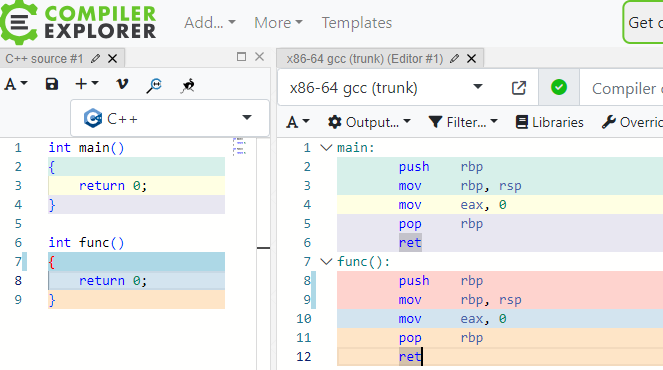

#### man函数


写一个main函数和普通函数看看汇编指令的差异



从汇编代码上看 main和func无差异，写一个普通函数的c文件

```
#include <stdio.h>
#include <stdlib.h>
void func()

{
    printf("\nhello world\n\n");
    exit(0);
}
```

```
编译结果报错找不到main：
PS C:\Users\shoucheng.mi\Desktop\out> g++ test.cpp
c:/mingw/bin/../lib/gcc/mingw32/6.3.0/../../../libmingw32.a(main.o):(.text.startup+0xa0): undefined reference to `WinMain@16'
collect2.exe: error: ld returned 1 exit status
```

使用下面参数编译

```
gcc -nostartfiles -efunc test.cpp
```

```
PS C:\Users\shoucheng.mi\Desktop\out> gcc -nostartfiles -efunc test.cpp
c:/mingw/bin/../lib/gcc/mingw32/6.3.0/../../../../mingw32/bin/ld.exe: warning: cannot find entry symbol func; defaulting to 00401000
PS C:\Users\shoucheng.mi\Desktop\out> .\a.exe

hello world
PS C:\Users\shoucheng.mi\Desktop\out>
```

**总结一下：**

​		**1.CPU面前函数没有主次之分，main函数的实现方法和普通函数完全一样；**

​		**2.main函数是很多函数的默认起点，但绝不是非他不可，任何函数都可以被设置为程序起点。**

​		
