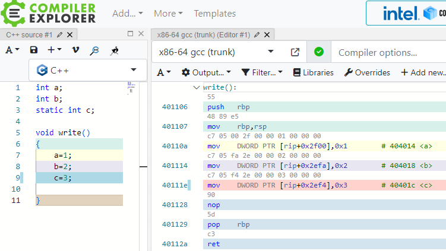
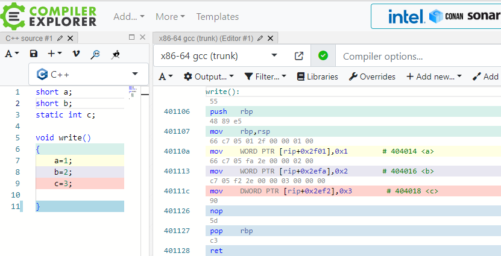

#### 变量

打开Compiler explorer ，定义3个变量:

由上图可以看出上图变量啊，b,c的地址是0x404014,0x404018,0x40401c 他们两两相隔4个字节，说明int类型变量占据4个字节的内存空间，如果把int换成short 则两两相隔2字节，则如下图：

同理char 会占据1个字节的内存空间：

**总结一下：**

**1.每一个变量，都对应了一个内存地址，变量的类型决定了它所占用的内存空间的长度**

**2.静态变量和全局变量对应的内存地址是全局唯一的，不会随程序的运行而变化，但是局部变量，也叫栈变量，临时变量就没那么幸运了，不仅变量的值有有效期的限制，而且局部变量的地址也会因不同线程调用而不同，即便是在同一个线程中，也会因为调用轨迹的不同而不同**

