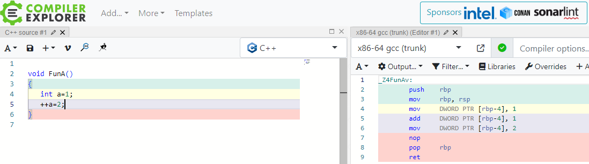

先写一个前加和后加函数


两者执行的指令完全相同，再做一个实验：给变量赋值


可以发现前加只要三行指令，后加需要四行指令了，前加快，本质上赋值时后加需要开辟一个临时变量edx,存放计算结果，然后再将edx中的值赋值给变量a.即分两步完成：

```
1.创建临时变量
2.给临时变量赋值
```

造成这样的原因是后加是右值型


右值类型的变量只能给别人赋值，而且程序员看不见；

前加是左值的，左值的可以直接赋值

看下面的例子：++a是可以被赋值的



a++ 编译器会提示错误：


**结论：通常前加和后加没有任何差异，但出现赋值时前加会略快，但优势可以忽略不计，喜欢谁用谁就可以了，但是类对象的++运算首选前加（后加的劣势会被无限放大）。** 