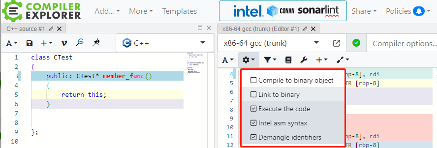
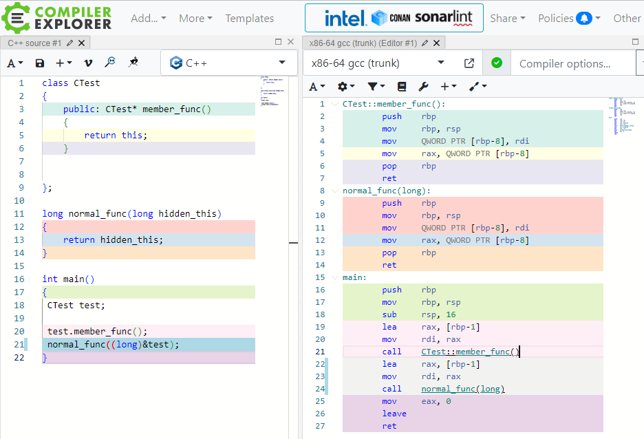

# this指针

先对在线编译器做如下修改：

我们写一个最简单的c++类和最简单的普通函数，看看成员函数和普通函数有何区别，当然只考虑函数本身是不全面的。

可以发现成员函数和普通函数是没有区别的，所以从CPU的角度看两者是完全等价的。this指针就是这个普通函数的参数，现在可以知道this指针是每一个成员函数默认的必备的一个参数，只是C++语法将它隐藏了起来。但普通参数该做的事情，this都做了。

​		那是谁给成员函数输入的这个this指针呢？看看调用部分，两者的调用部分完全一致，所以从CPU角度看，输入this指针就是输入test对象的地址，当对象调用成员函数时，都会把自己的地址当做this指针输入给成员函数，只是C++语法将它隐藏了。

