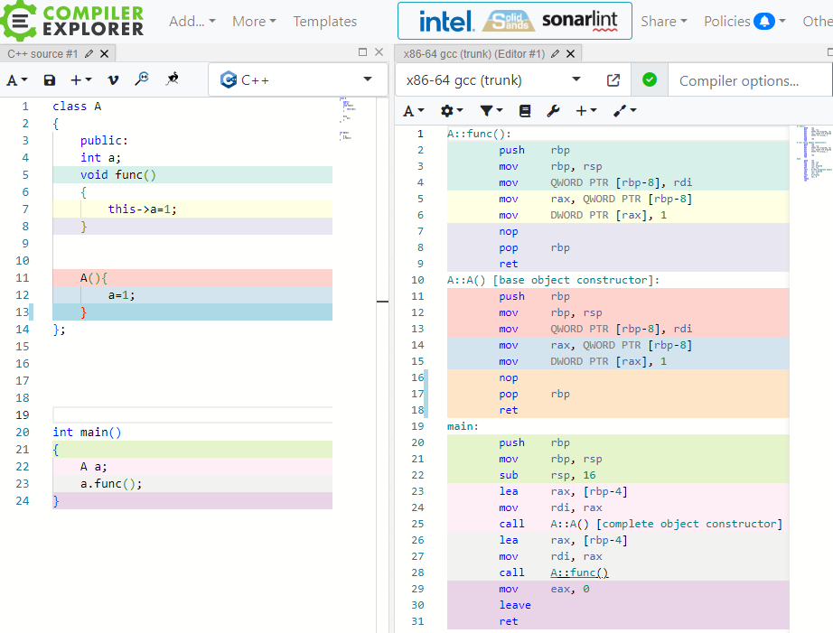
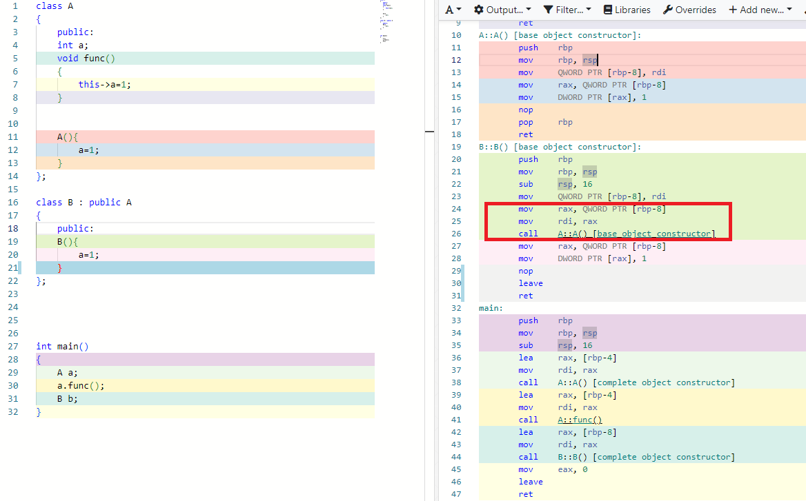
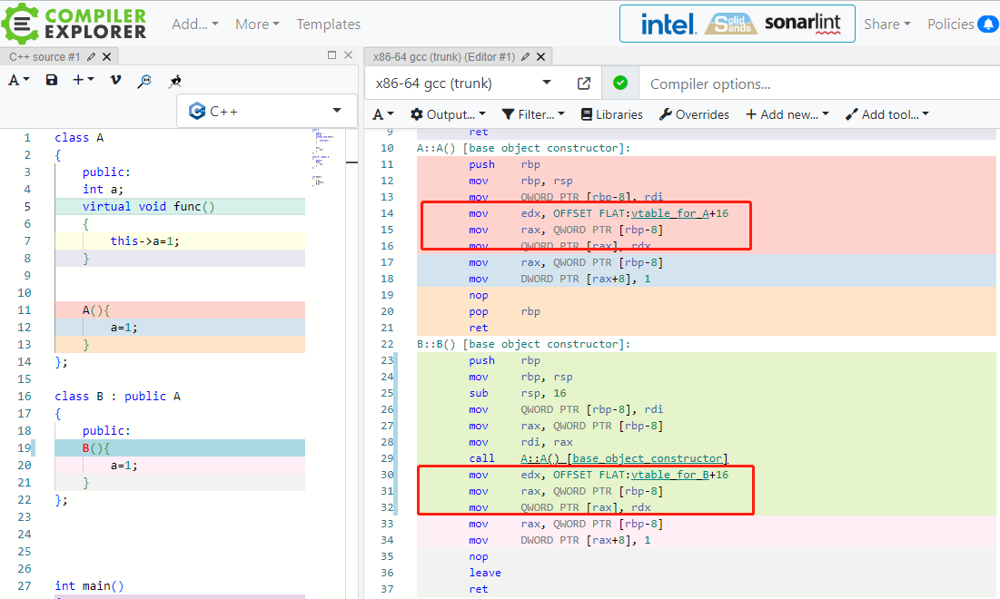

# 构造函数

构造函数可能是C++世界里最神奇的一个函数了，江湖上到处流传着它的传说。我们从CPU的角度来会会它，花点时间揭开它神秘的面纱，让我们开始吧。

直接对比构造函数和成员函数的汇编指令，两者是一致的，就连隐藏参数this指针，也是一样的套路，没想到，即使是构造函数也不能免俗，也会偷偷夹带一个this指针。**所以在没有继承的情况下，构造函数和普通函数没有任何区别**。

​		增加一点难度，增加一个派生类B,

**我们可以发现B的构造函数多了3条指令，前两条是在输入隐形参数this指针，第3条是在调用A的构造函数，**这也是为什么派生类的构造函数总是调用基类构造函数的原因。其实这就是一个普通的函数调用。

​		再加入终极难度：虚函数,将类A的普通函数变成虚函数，此时你会发现A,B的构造函数都会多出3条指令，

从字面可以猜出，这是在记录虚函数表的地址，A的构造函数只会记录A的虚函数表地址（地址存在this指向的位置），B的构造函数只会记录B的虚函数表地址（地址存在this指向的位置）,从而保证A和B的对象实例在调用虚函数时候，能区分你我，井水不犯河水，这也就是所谓的动态绑定。

​		**总结：**

​		**1：构造函数和普通函数一样都需要夹带隐藏参数this指针**

​		**2：派生类的构造函数调用会夹带的调用基类的构造函数，如果存在虚函数，构造函数会记录虚函数表的地址**