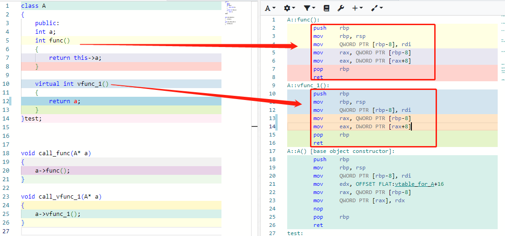
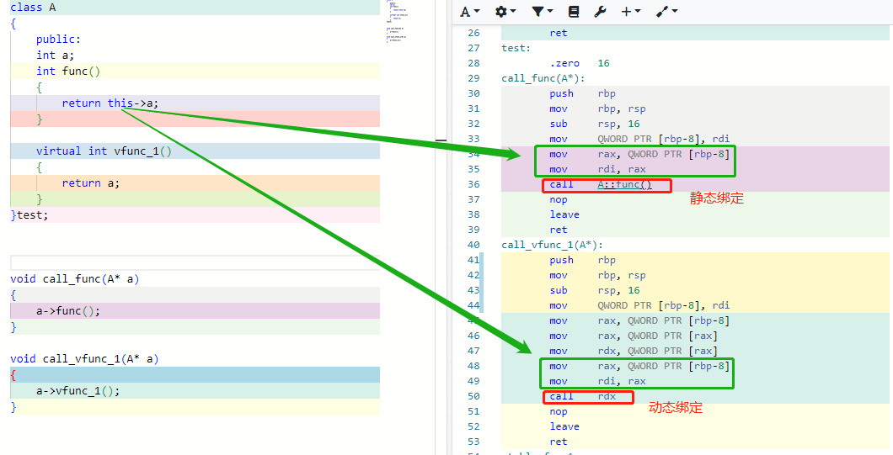
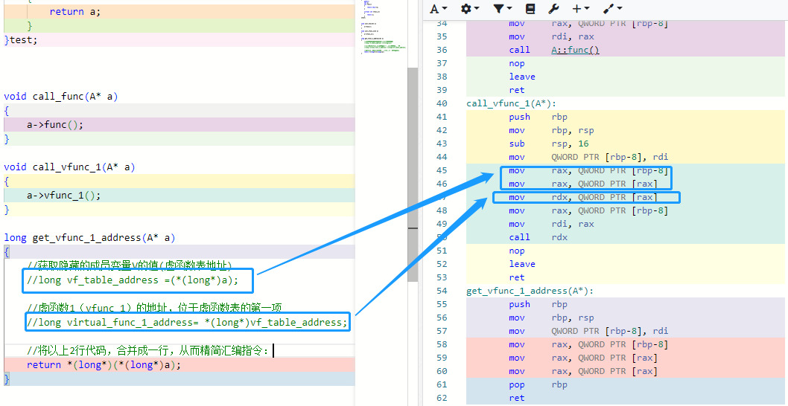
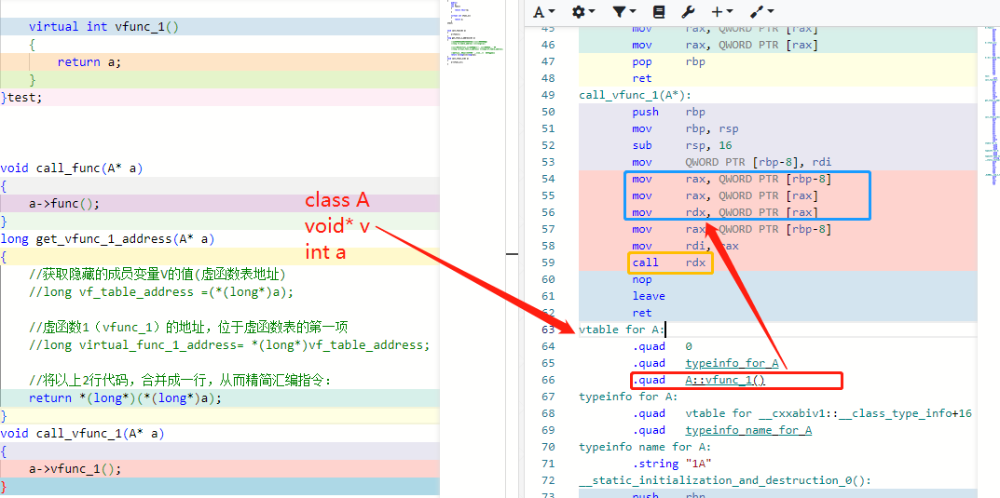
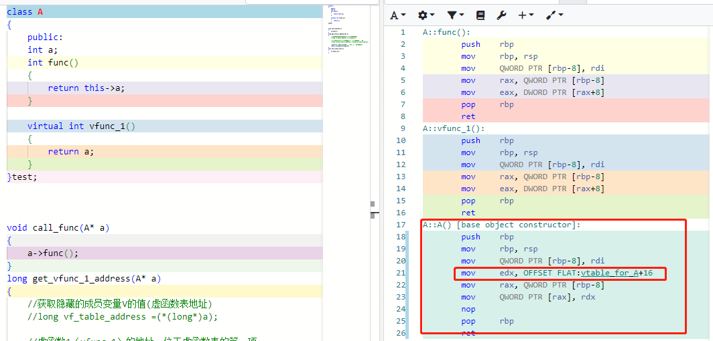
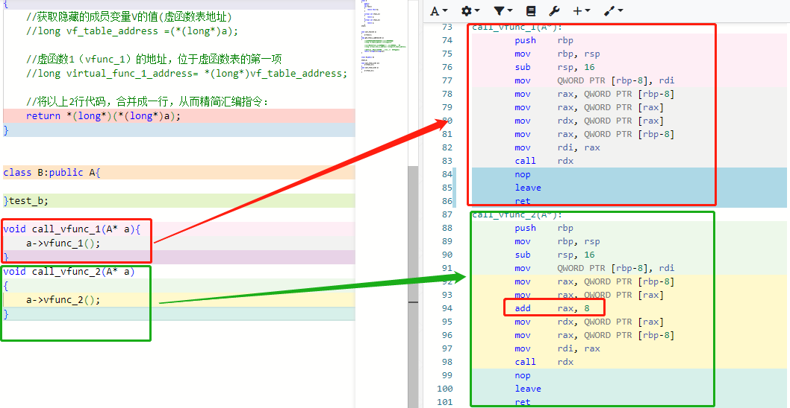

# 虚函数

​		虚函数作为C++的重要特性，让人又爱又怕，爱它功能强大，但又怕驾驭不好，让它反咬一口，今天，我们就从CPU视角撕掉语法伪装。注：我们只比较指令的差异。



显然两个函数完全一致，虚函数和普通函数没有任何区别，都会夹带this指针，如下代码表示this指针的入参

```
        mov     QWORD PTR [rbp-8], rdi
        mov     rax, QWORD PTR [rbp-8]
```

让我们再看看调用他们有什么不同：



可以看出普通的函数调用在编译阶段地址就已经确定了，就是所谓的静态绑定而虚函数的调用，call指令只能根据rdx寄存器的值来确定函数位置，也就是所谓的动态绑定。所谓的动态绑定也不过是下面三条指令而已：

```
        mov     rax, QWORD PTR [rbp-8]
        mov     rax, QWORD PTR [rax]
        mov     rdx, QWORD PTR [rax]
```

有兴趣的小伙伴可以细品这三条指令。下面是等价代码：



**结论：**

​		**当类A有虚函数的时候，类A就会偷偷生成一个隐藏成员变量，方便起见，我们为这个变量起一个名字：V（指针类型），V存放在虚函数表的地址，根据偏移就可以得到要执行的vfunc_1 的地址，将其存放在rdx寄存器里面，随后一条call rdx 指令，一个虚函数的调用就完成了。**



**类的成员函数会夹带隐藏参数this指针，还能接受的话，那么类还会夹带隐藏变量V,你能接受吗？如果真的存在隐藏变量v,那么在哪里给V初始化呢？答案是在A的构造函数中，把V初始化成类A的虚函数表地址**




**如上图，尽管我没有写构造函数，编译器还是会给我生成一个默认的构造函数，它一定必须帮我完成隐藏变量V的初始化。**

​		**当然如果类A有派生类B的话，隐藏变量V会在B的构造函数中被初始化为B的虚函数表地址，从而保证A和B的虚函数表相互独立，井水不犯河水，但考虑到派生类B还会调用基类A的构造函数，因此变量V一会儿被初始化为类A的虚函数表，一会儿被初始化为类B的虚函数表，为了避免晕头，往往禁止在构造函数中调用虚函数。**

**总结：**

**1.虚函数在虚函数体方面和普通函数没有任何区别，**

**2，虚函数的调用，需要借助类对象的隐藏变量v(vptr)来完成，隐藏变量V会在构造函数中被初始化成虚函数表的内存地址，最后，调用任何虚函数的套路，都是一样的，唯一的区别是要根据他们在虚函数表的位置，设置正确的偏移量，**



不得不佩服虚函数的实现方法，虚函数的出现使指针的使用率大大降低。