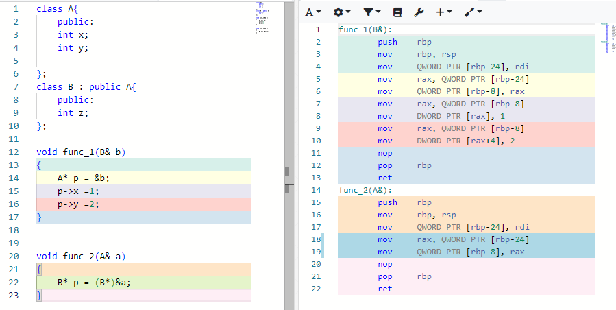
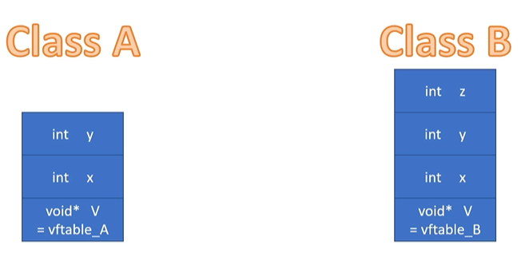
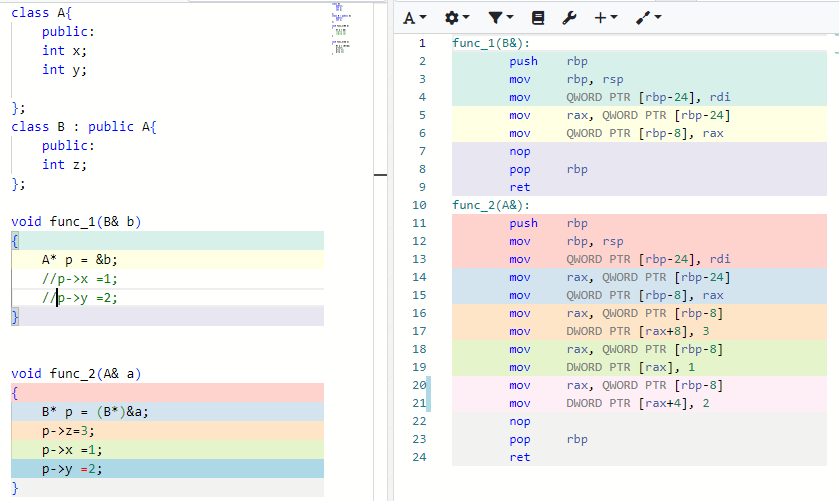
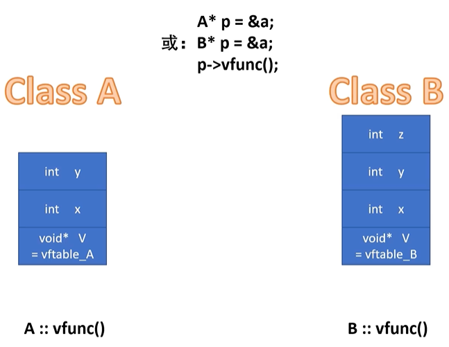

# 多态

多态是一种合法的类型转换。没有一种类型转化是安全的，编译器唯独给多态开了一个特例，那这样做安全吗？答案是安全的。

这要从类的数据结构说起（以32位操作系统为例）

起始的4个字节分配给变量x,随后的4个字节分配给变量y,如果有虚函数的话x,y同时上移，把起始的4个字节留给隐藏变量V，用于存放类A的虚函数表地址，再看看类B的数据结构，首先全盘复制类A的数据结构，如果类B有虚函数就把隐藏变量v改为B的虚函数表地址，最后在末尾增加4个字节分配给变量z

发现有趣的事情是如果不考虑B的特有变量z,A,B的数据结构完全相同，完全可以把派生类B降级成派生类A来使用。这也就是常说的代码复用，相反，把基类A升级成派生类B来使用，可以吗？显然不行。因为A没有为变量z预留空间所以即使函数func2能编译通过，但一旦访问变量z就会越界，读写不到不属于变量a的内存空间，随后的情况不是程序崩溃就是运行异常，

当然，如果多态，仅仅是把派生类降级成基类使用，那就太没意思了，虽然复用了基类的共性，却没有体现出自己的特性，如何体现特性呢？答案是虚函数。

如07，虚函数所讲：根据动态绑定的实现原理，无论指针P是什么类型，当p指向类A的对象是，它会调用类A特有的虚函数，当p指向类B的对象是，它会调用类B特有的虚函数，这也是多态的精髓,调用相同名称的函数，却会根据对象的实际类型执行不同的函数版本。就这样，类B不仅可以复用类A的属性（变量/函数），还可以扩展自己的特性。

**总结：**

**1.多态常会用基类指针指向派生类对象；**

**2，多态会利用派生类的结构特点复用基类的属性（变量/函数）；**

**3,多态会利用虚函数来扩展派生类的特性。**

