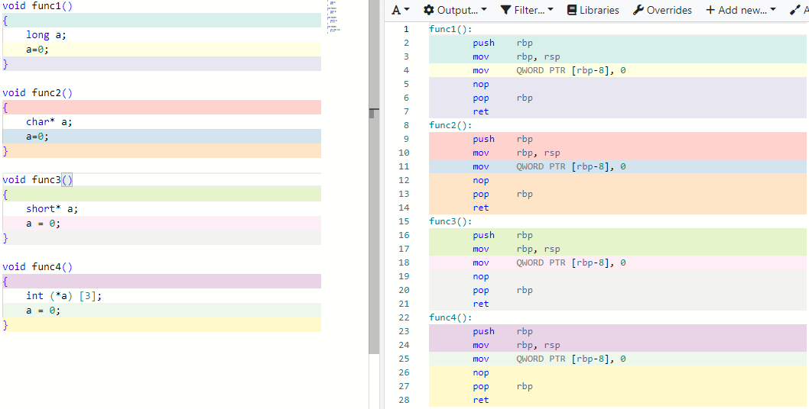

指针变量和普通变量到底有什么相同？有什么不同呢？

先说说相同之处：

 

如上图定义一个普通变量，3个指针变量并都写入0，老规矩，不理会汇编指令的含义，这几个函数的汇编指令完全一致，无论是什么类型的指针变量的读写，跟普通类型变量读写完全一致，所谓的指向，不过是在描述指针变量的值是多少而已，所以就变量读写而言，指针变量跟普通变量，没有任何区别。

**指针变量的特性**：最显著的就是*操作

```
{
//address a: 0x1234
//address b: 0x1238
int a =1;
int* p =&a;
*p = 2;
}
```

注意：程序里面不会出现a ,p 这两个字符，他们不过是0x1234,0x1238 这两个地址的别名，

1.第一行定义一个变量a并赋值为1(也就是：把1写入到：地址为0x1234的内存里面)；

2.然后定义一个指针变量p,并赋值为：变量a的地址(也就是：0x1234写入到地址为：0x1238的内存里面)；

3.最后，对p进行*操作.该操作需要分两步完成，第一步：也就是：读取地址为0x1238处的内存值：0x1234;第二步：把2写入到：地址为0x1234的内存里面。

好了以上就是指针变量特有的*操作。

如果说：普通变量可以不赋：初值的话，那指针变量的初值必须万分慎重！因为未来的*操作会以这个初值为：目标内存地址，并往里面读写数据，所以，给指针变量赋值，一定要是合法合理的内存地址，否则一旦读取非法地址，程序或马上崩溃，或向下面示例一样

```
int *p =?
*p =2;
```

偷偷把变量的值偷偷改为2（大家称这种情况也叫野指针）.


**总结**

​		 **1.指针变量也是变量，读写操作，跟普通变量完全一致。**	

​	 	**2.普通变量的值，多用于：数学计算，而指针变量的值，往往用来：定位内存，它可以是某个变量的地址，常量的地址，cpu寄存器的地址，还可以是受保护的地址空间**

​		**3.指针变量的*号操作，是对内存的读写操作，它可以改变变量的值，常量的值，cpu寄存器的值，还可以试图读写：受保护的地址空间，当然由于MMU的保护机制，当访问到：受保护或非法地址时，会激发：setmentation faut，让程序立马崩溃止损。而如果没有mmu，程序会一直讲错就错的执行下去，最后，指针变量做+-运算，也是在做地址偏移，以加1为例，不同的指针类型，偏移的步长也不相同.**

