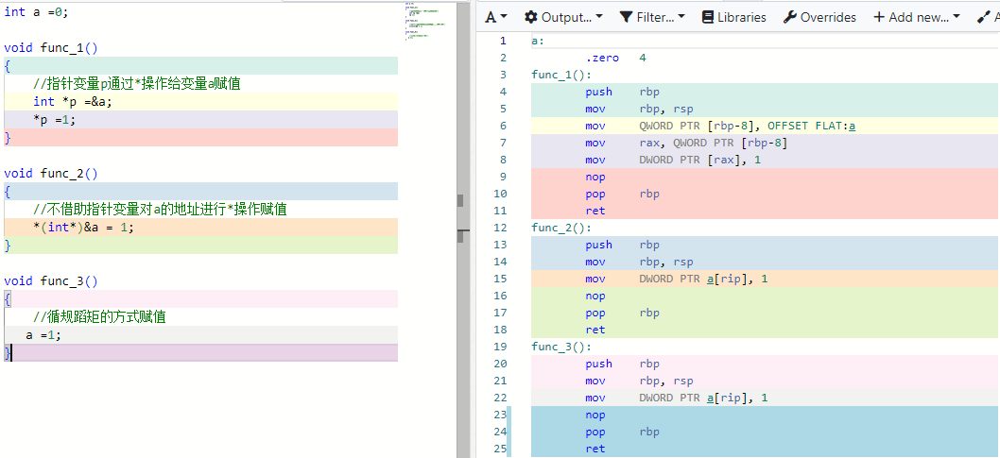
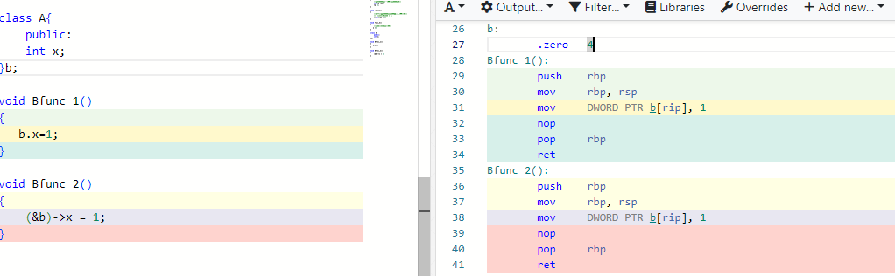
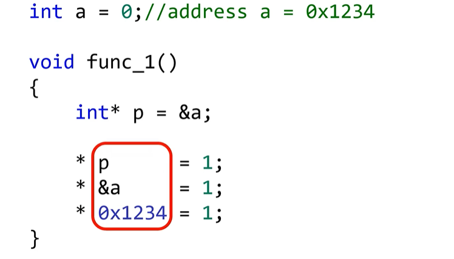

指针的本质是内存地址，可无论是普通变量，还是类的成员变量，谁还能没有一个内存地址呢？既然普通变量有内存地址，那普通变量能像指针变量那样进行指针操作吗？也就是指针的*操作和->操作，答案是肯定的。

上图func_1和func_2，如所见，普通变量也能进行 * 操作，只要知道变量a的地址就可以进行指针的 * 操作，还省掉了指针变量的开销，更简单直接。常规的变量a赋值func3和func_2的汇编代码没有区别，完全一致，所以，我们熟悉的变量读写都等同于 对变量地址的指针 * 操作,正如变量的定义所言：变量不过是内存地址的别名。

​		同样的道理，不借助指针的*操作，我们也可以通过指针的->操作对类的成员变量赋值。

**总结：**

​		**1.指针操作不是指针变量的专利，普通变量，甚至是立即数也可以做指针（* ，->）操作**

​		**2.计算机的世界里面万物皆有地址，所以万物皆可指针，你既可以循规蹈矩的通过变量名，或者规定的函数接口读/写变量，也可能无视规则通过指针操作，随意，随时，随地的读/写变量**

​		**3.除了0x1234指针操作可以读写：任意的内存地址，除了内存管理单元MMU,没人能制止这种：读/写行为**

