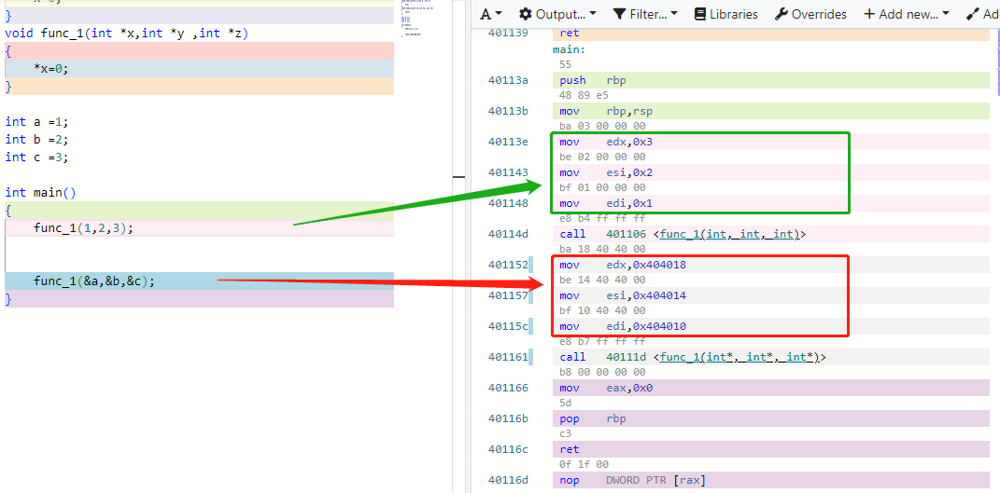

写一个简单的传值调用和传引用的调用函数

第一次调用是传值的方式，第二次调用是传指针的方式，如你所见

传指针的三条指令显然是把数值： 0x0x404018,0x404014,0x404010传递给寄存器，edi ,esi ,edx.其中0x0x404018,0x404014,0x404010是变量a,b,c的内存地址，显然无论是传值还是传指针，他们的实现原理都是把参数，传递给cpu寄存器.

​		总结一下。在cpu眼里没有传值，传指针的概念.或许唯一的区别就是传递的数值，略有不同；2传递参数就是在给寄存器赋值，寄存器是：主调函数是向被调函数输入参数的载体。

那么现在知道为啥在func_1里面改变x的值对变量a是没有影响的吗？因为传值操作只是通过寄存器向func_1暴露了变量a的值，func_1只是得到了变量值的复制品，所以修改x的值只是在修改"克隆体"而已，对本地没有任何影响.

​		那么在func_2中可以改变变量a的值呢？因为传指针操作暴露了变量a最隐私的“个人信息”,全局定位数据(简称内存地址)。

