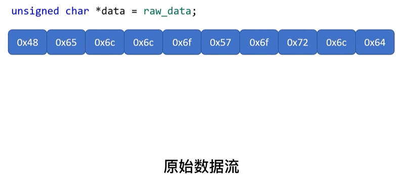
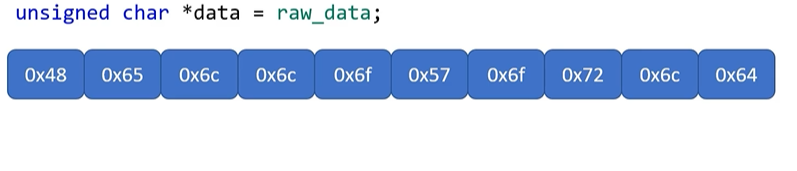
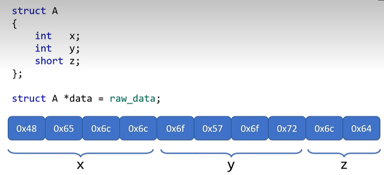
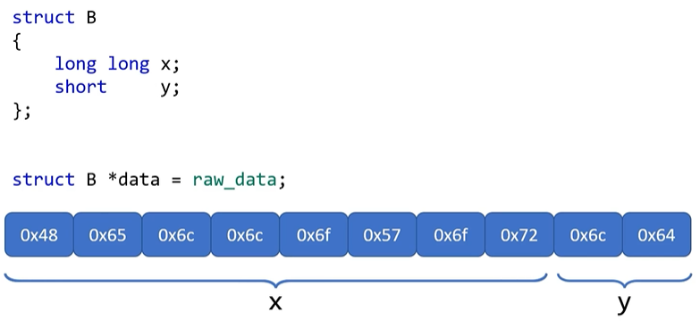
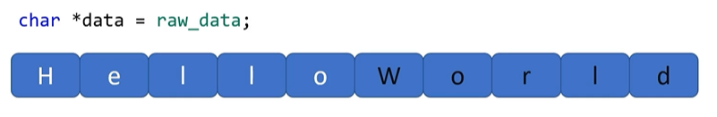

#### 指针妙用一 ：零拷贝

​		假设：你要传递一个体量很大的对象给某个函数，如果采用常规的传值方式，就需要创建一个：相同体谅的临时对象，这会大大挤压系统内存，但如果传递指针的话，我们只需要传递：4个字节（32位操作系统）的对象地址即可，这就省掉了拷贝工作和不菲的内存开销。

#### 技能二：驱动硬件

​		例如：为了驱动一个电动风车，转起来，你需要对一个芯片的IO引脚，输出高电压，由于硬件设备和使用场景的巨大差异，没人能先定义好响应的函数接口，取而代之的是芯片制造商，会把控制I/O引脚的寄存器与内存统一编址，并提供手册，标识出IO寄存器对应的地址，这样我们就可以像访问内存一样，访问I/O寄存器，从而实现对引脚电压的控制，同样的道理，我们还可以用类似的方法来控制LED,机械臂和机器人。

#### 技能三：无穷变身

​		假设你从U盘里读出一段原始数据流

如果用unsigned char 来解读则是简单的数组，

如果用结构体A的指针类型来解读数据的话，就是如图所示

而用B的结构体滋镇来解读的话则是下图样式

  

最后如果用char指针类型来解读的话就是字符串

**总结**

​		**1.仰仗指针的精确定位能力，可以直接定位数据，从而避免了拷贝工作**

​		**2.还是因为指针的精确定位能力，我们还可以访问：硬件相关的寄存器，当你能控制硬件的时候，你会感觉：计算机系统上的每一寸资源都是自己的。**

​		**3.相对于面对对象的多态，指针对各种数据类型的兼容性，简直是变态级别的存在（类型转换）**