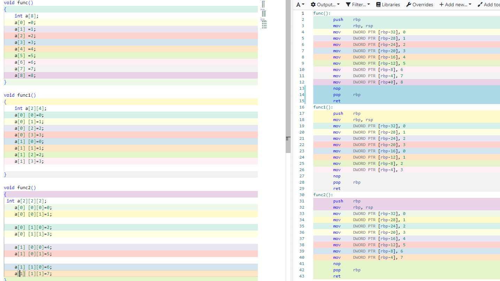

# 数组

打开 compiler explorer 写一个最简单的对数组赋值的函数

从汇编代码中不难发现这是在给一段连续的内存赋值，因为int 类型是4字节长度，所以每个元素的地址间隔都是4字节

同理如果是char类型，每个元素的地址间隔是1字节，脑补下数组在内存中的样子，大概长下面的样子

看到这个图，用指针操作的话只需要知道数组a内存首地址和数组长度

写一个指针变量做参数的函数和数组做参数的函数

没想到吧，两者的汇编指令完全相同，所以，无论你的数组有多大，编译器都不会像对普通变量那样，为你在堆栈中构建一个临时的数组变量，而是简简单单的传递一个内存首地址，并存放在一个临时的指针变量里面，而数组的读写则等价与指针的 * 号操作，正如前面所说：万物皆指针，数组首当其冲。再写一个函数，做一下调用

如图所见，这三种调用的汇编代码完全一致，他们本质上完全相同，都是在传递数组内存首地址，而非构建临时数组变量，我们需要习惯这种传递指针的形式，很多知名的开源代码也是这样做的。当然为了防止数组越界，还会增加一个数组长度的参数。接下来是二维，三维数组，可能我们会这样想一维，二维，三维数组

但很遗憾，计算机的内存是一维的，在cpu眼里他们都一维数组

他们的汇编指令2完全相同，所以无论是1维的还是高维的，他们都是一段连续的一维内存、

**总结**

**1.数组是一段连续的一维内存，除了定义数组变量，也会用指针来表示数组，并用指针的*操作来来读写数组元素**

**2.传递数组参数，本质上是传递数组的指针，所以在函数内改变数组的值也会在函数外改变数组的值。**

**3，高维数组本质上还是一维数组，只是索引的方式不同，应用的场景不同**。