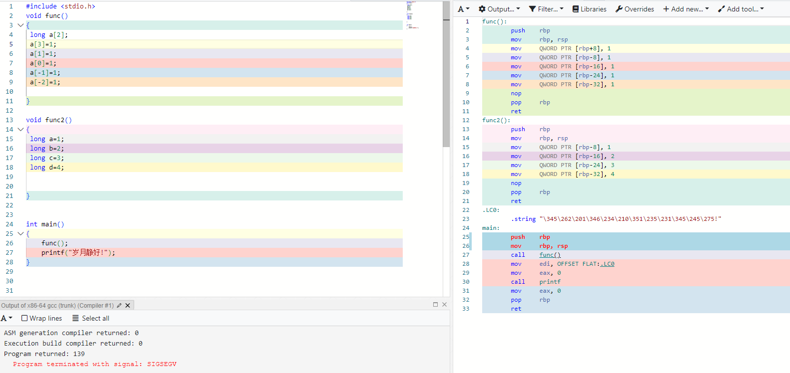

# 数组越界，堆栈溢出

打开 compiler explorer 写一个简单的对数组赋值的函数func定义一个数组并依次给数组元素赋值<数组函数越界>，最后写一个函数main做一下函数调用

  

那数组越界了会发生什么事呢?最直接的答案可能是segmentation fault(core dump).答案如下图，如你所见岁月静好  

越界的-1，-2号元素相当于偷偷拓展了2个变量c和d，之所以暂时安全是因为越界元素所在的内存是一块：无主之地

，此时的读写操作不会影响到任何人，定义变量的过程就是向下扩展堆栈的过程。

​		如果说向(低端地址)下越界是开疆拓土，那向高端地址（上）越界就是调转枪头的内卷了，让我们做一个最谨慎的向高端地址越界看看，很遗憾 segmentation fault.

  

因为函数1堆栈上方可不是无主之地，这里存放这引导cpu跳转的指令信息，当函数1执行完后，cpu就靠这个信息回到调用者main函数哪里，很显然让cpu跳转到0必定会导致异常，当然，想修正也很简单恢复到原来的地址就好了，很显然main函数调用函数1后只有回到如下图0x41185才能继续执行main函数的其他操作，

  

所以我们把这个地址拷贝回去，好了，程序再次岁月静好了。当然我们可以填写正确的地址，黑客就可以填写恶意代码的地址。而有趣的是存放恶意代码的地方往往是这个数组

**总结**：

​		**数组向高端地址越界会修改堆栈中中的关键数据，程序往往会立刻崩溃，但明枪易躲，暗箭难防，数组向低端地址越界，程序往往不会马上崩溃，可一旦与其他函数冲突时，其诡异行为绝对超出你的想象，所以无论哪种越界都要积极避免。**

​		**最终，数组越界在实际编程中，是非常隐蔽的，例如拷贝字符串，用全局变量索引数组元苏苏苏都是数组越界的重灾区，时刻保持对数组的警惕是非常必要的。**