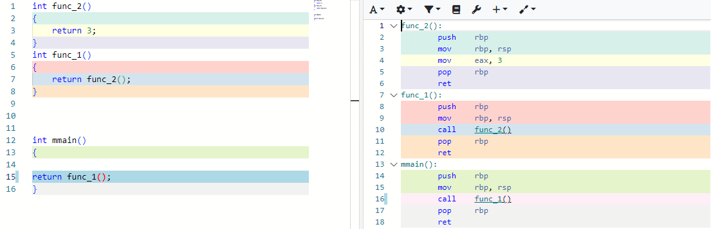
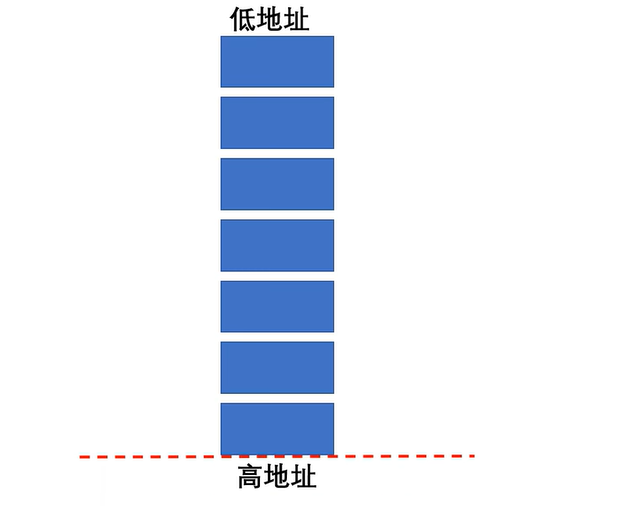
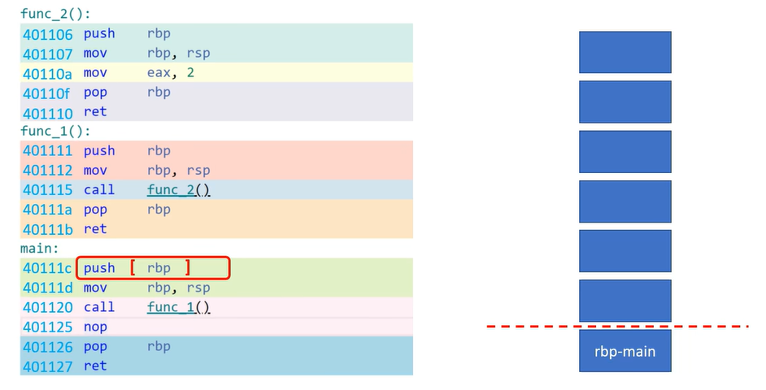
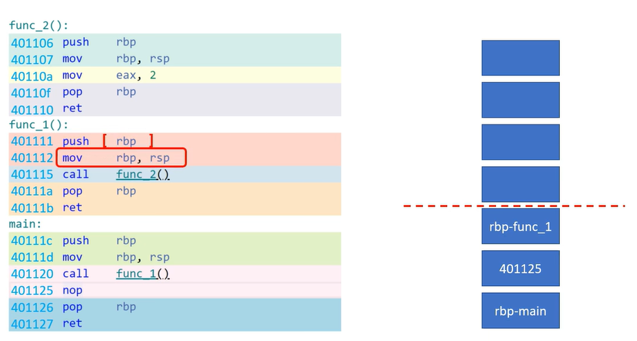
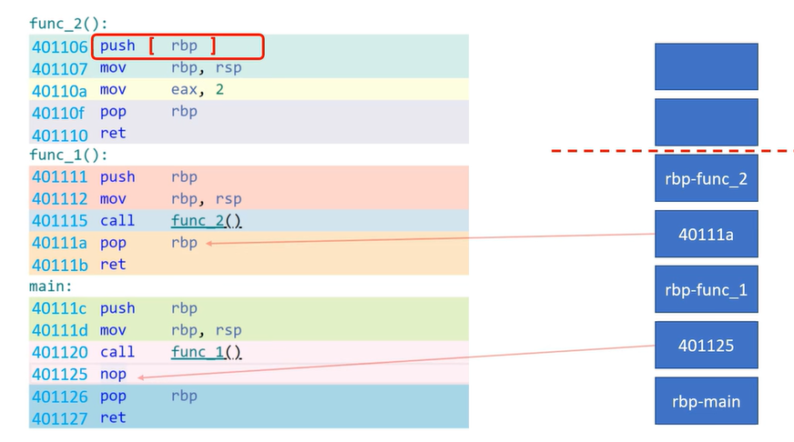
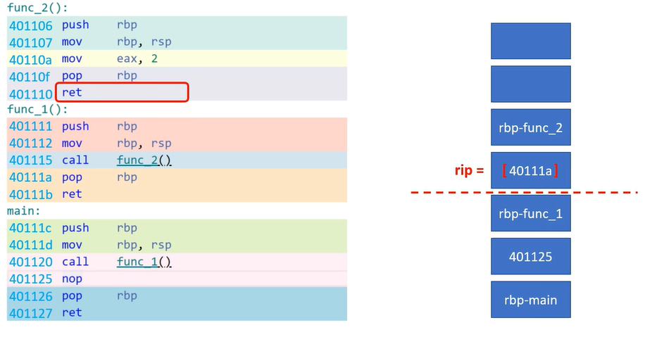
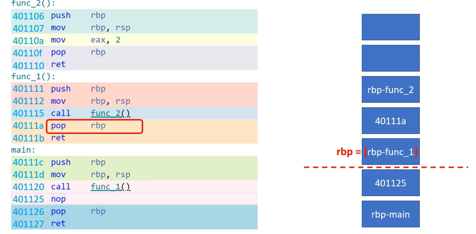
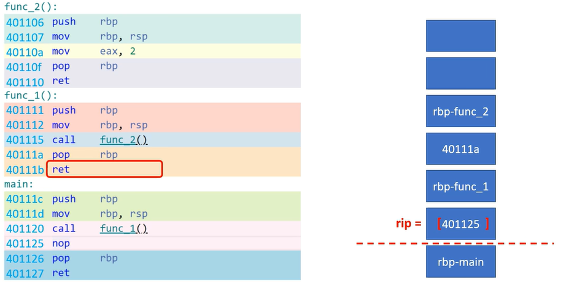
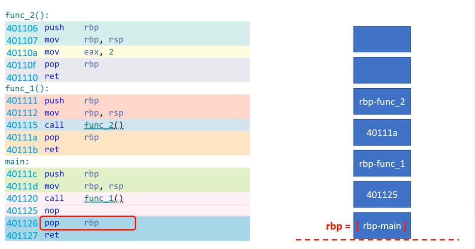
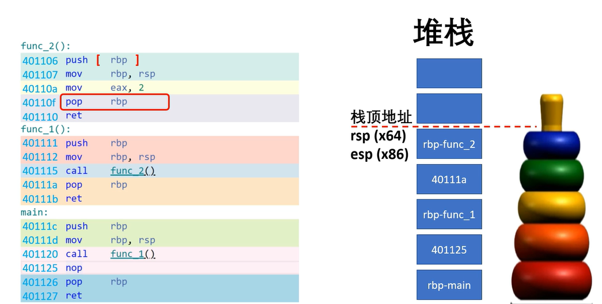

### 函数调用|调用栈回溯


IDE是如何回溯出调用轨迹的，操作系统会为每一个线程准备一段内存，专门用来记录该线程的：函数调用轨迹，



为方便展示，下方为高地址，上方为低地址，然后用一根水位线表述该内存的使用量



```
func_2():
        push    rbp
        mov     rbp, rsp
        mov     eax, 3
        pop     rbp
        ret
func_1():
        push    rbp
        mov     rbp, rsp
        call    func_2()
        pop     rbp
        ret
mmain():
        push    rbp
        mov     rbp, rsp
        call    func_1()
        pop     rbp
        ret
```

首先从main函数开始，第一条push指令，把rbp寄存器的值存入内存，具体值并不重要就用rbp-main标识一下好了



mov指令对内存无影响可略过，call指令会把下一条指令的地址存入内存，然后cpu跳转到函数1继续执行，函数1的push指令会用push指令将rbp寄存器的值存入内存，mov 可略过，



call会将下一条指令存入内存，然后cpu跳转到func2继续执行



善始善终，我们再看看返回过程

越过两条mov指令，pop指令会把水位线上的值赋给rbp,ret会把水位线上的值赋给寄存器rip,从而让rip引导cpu返回到func_1



返回到func1后，把水位线上的值赋给：寄存器rbp,

ret指令则把水位线上的值赋给寄存器rip



让rip引导cpu返回到main函数，回到main函数后，越过nop指令，随后的pop指令会把水位线上的值赋给寄存器rbp



至此，所有的函数调用结束，水位线有落回到了起点，内存完璧归赵；一点没多一点没少。

现在知道为什么这块内存叫堆栈了吧！因为它的存储方式是堆叠的，这里的水位线也就是大家常说的栈顶，



就保存在rsp寄存器里面。

**总结**：

​	**1.堆栈是一段普通的内存，每次函数调用都需要使用一定数量的内存，用来存放返回地址和其他信息，**

​	**2.每次函数的返回都会如数返还刚才调用时所占用的内存，但不会清理数据**

​	**3.如果函数嵌套调用过深，函数一直没有机会返回，并释放占用的内存，就可能出现水位线超标的现象，也就是所谓的堆栈溢出，**最典型的例子就是无穷递归，不得不佩服使用堆栈的设计方法，巧妙的解决了函数调用，返回等诸多问题，更是实现了程序运行效率和空间上的双丰收，当然堆栈不仅可以存放函数返回地址，还能存放参数，栈变量和其他数据。这也是每次函数调用都要存储，恢复rbp寄存器的原因

既然知道了函数调用的原理，手动回溯出完整的调用轨迹，就简单了，通过一个栈变量获得栈顶位置(栈顶的内存地址)，然后使用万能的指针操作遍历一段堆栈数据，再根据代码段的地址特性做一下过滤，配合map表一个完整的函数调用轨迹就出来了

![image-20230824174635238](./../.vuepress/public/img/CPLUS/image-20230824174635238.jpg" style="width:100%" />