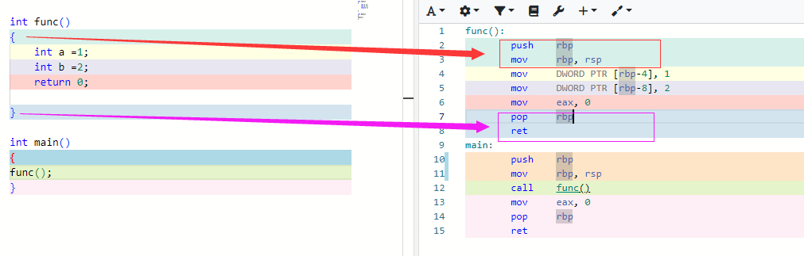
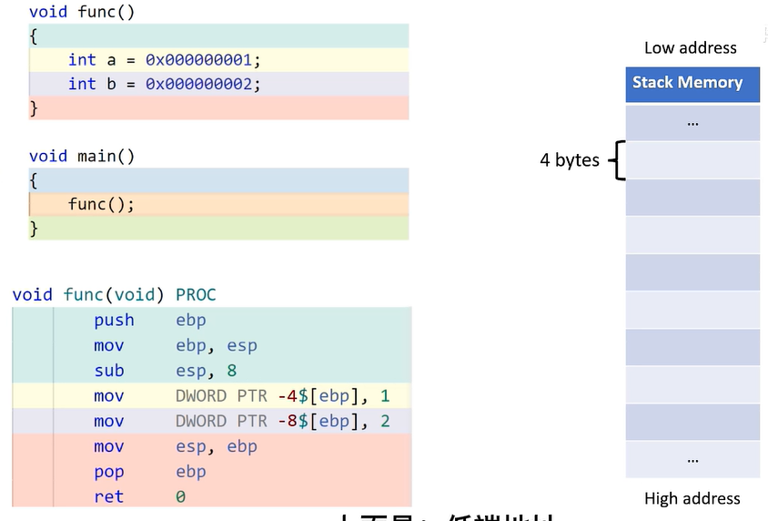
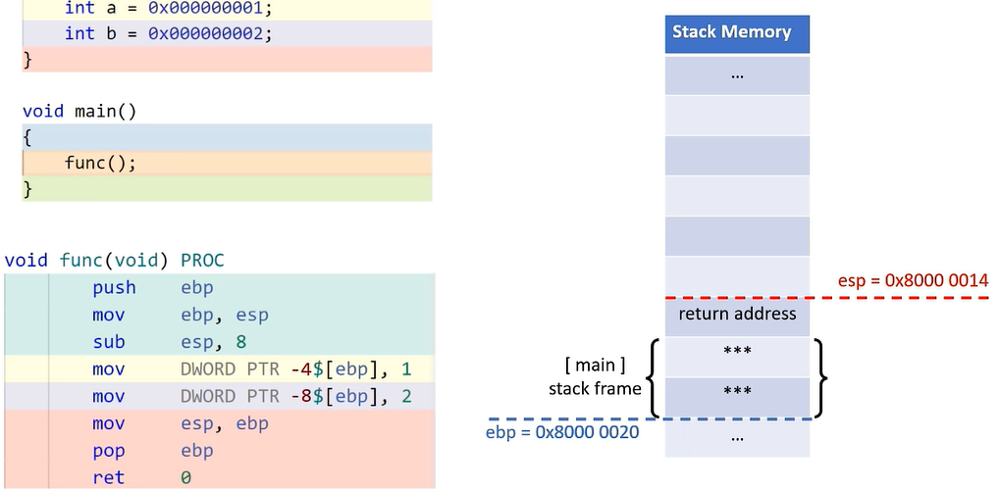
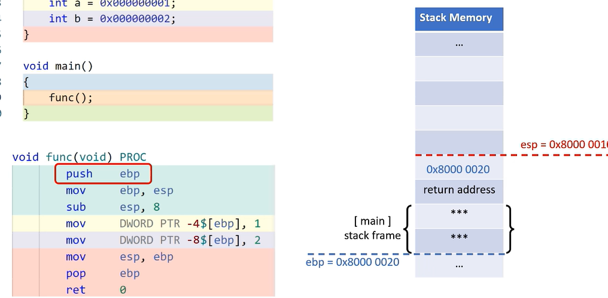
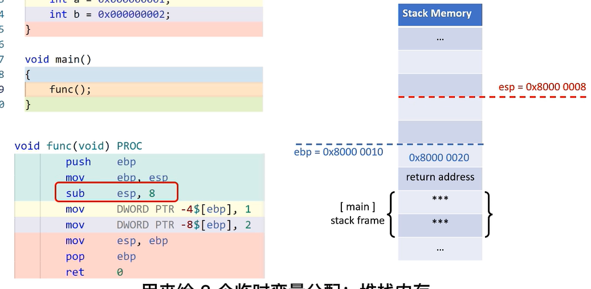
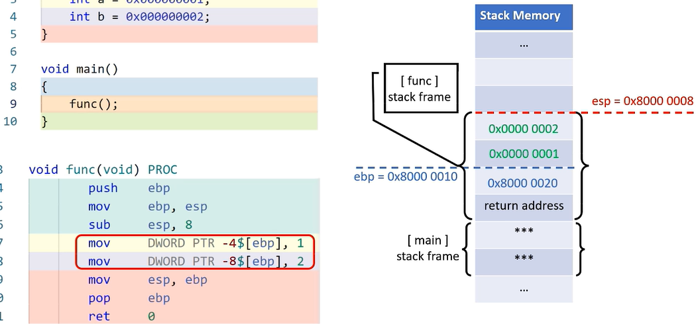
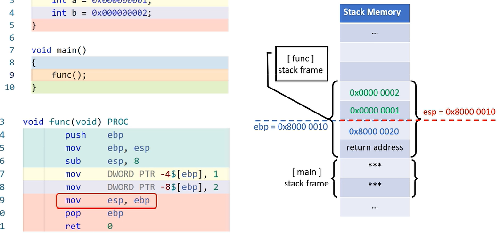
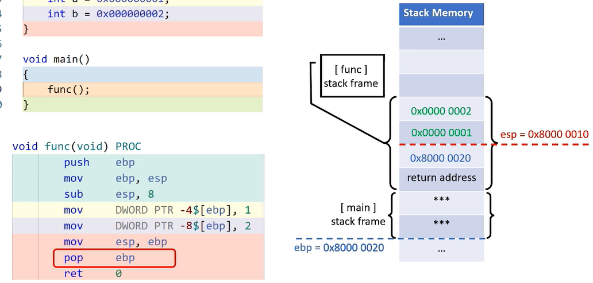
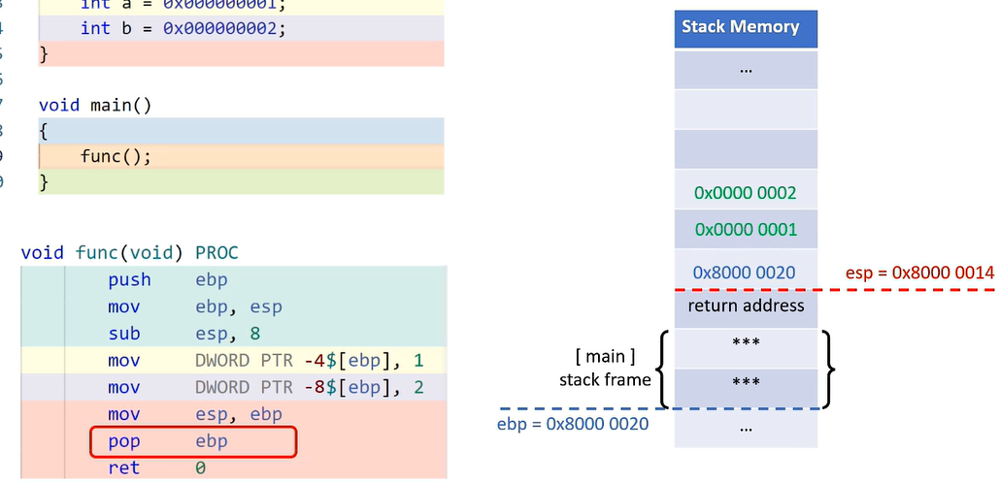

### 函数括号

在我们写过无数个函数后，是否会考虑一个问题？当我们在函数中一顿神操作后为什么函数返回后一切恢复如初？刚刚定义的临时变量去了哪里？答案就是写了无数次的{}，这中灵魂操作很少有人提及，毫无存在感，今天我们从cpu视角来看看这个灵魂操作。

​		打开compiler explorer 编写一个简单的函数和一个函数调用，

函数之间能随意调用还能顺利收场，就完全仰仗他们了，

假设这段内存是当前任务的堆栈，为了方便展示堆叠结构，下面是高端地址，上面是低端地址

初始栈帧是main函数的栈帧，在红蓝两条线之间，红色用来标识栈顶地址esp的值，蓝色用来标识栈基ebp的值，用来标识main函数栈帧基地址。不用关心main函数的栈帧，一切从函数func开始，首先执行第一条指令将ebp压入栈顶，栈顶水位线也随之升高

main函数的栈帧保护工作完成，然后通过mov指令更新一下栈帧基准线，让它与栈顶水位线齐平，

通过sub指令将红色水位线上升8个字节，

随后就是对临时变量a,b赋值，a,b相对于蓝色基准线的偏移刚好是4和8，正好用玩函数的栈帧，一点不多，一点不少，好了，函数执行完是该恢复main函数的栈帧了，

通过mov指令将红色水位线先降低至蓝色基准线位置，然后通过pop指令把事先压入栈顶的ebp值，返还给寄存器ebp,这样蓝色基准线又恢复到了最开始的位置。

同时随着栈顶的下降，红色基准线也随之下降

至此，main函数的栈帧恢复完成，不准确的说，函数的栈帧就是红蓝两条线之间的内存块，它用来存放函数的临时变量，参数和返回地址。所谓的保存或者恢复栈帧，不过是在变更ebp和esp的值。

**总结：**

**1.操作系统会为每个任务分配一段内存，当作任务堆栈，cpu会提供两个寄存器esp和ebp用来标识当前堆栈的使用情况，随着函数的调用，函数的栈帧会逐次堆叠，互不重合，随着函数的逐次返回，函数的栈帧会：被就地放弃，但不会清理内存。**

**2.正括号用来保护上层主调函数的栈帧，并设置被调函数的栈帧，反括号用来放弃被调函数的栈帧，同时恢复主调函数的栈帧，这样被调函数执行完后，主调函数就会继续执行。、**

**3.ebp寄存器作为当前函数的栈帧基地址，配合一定的偏移就可以读写函数体力的临时变量，如果一个变量是通过ebp寄存器间接访问的，它往往是临时变量，也叫栈变量，**

**4.不同编译器对栈帧的实现方法略有不同，但思路一致。**