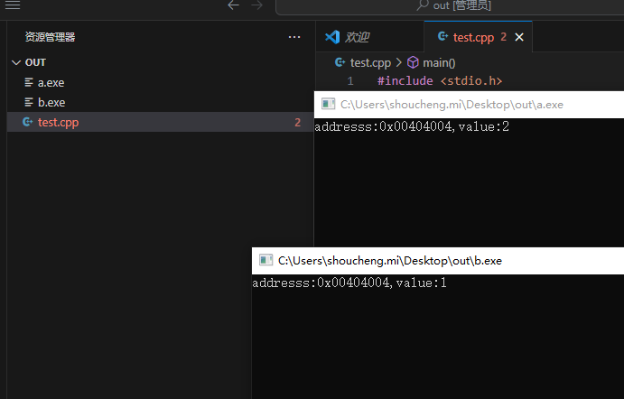

### 进程vs线程


打开vscode 编写一个小demo

```
#include <stdio.h>
#include <unistd.h>

int a =2;
int main()
{
    printf("addresss:0x%p,value:%d",&a,a);
    sleep(100000000);

    return 0;

}
```

先编译为a.exe 

```
gcc test.cpp -o a.exe
```

修改a的值为1再次编译为b.exe 分别运行a.exe,b.exe,发现有相同的地址？



这要感谢cpu的内存管理单元，上面的两个a的地址是虚拟地址，但实际上被MMU映射到了不同的物理内存上，这就是进程区别于线程的地方，空间独立性，所谓的空间独立性就是有一只井底之蛙，它固执的认为自己拥有整个天空，但它永远不知道天空到底有多大，更不知道周围还有很多和它有一样想法的青蛙，


而MMU就是束缚这些青蛙的井，每一口井就是一个进程空间，娃就是进程，没有MMU的话就不存在进程了就是线程（或者task）