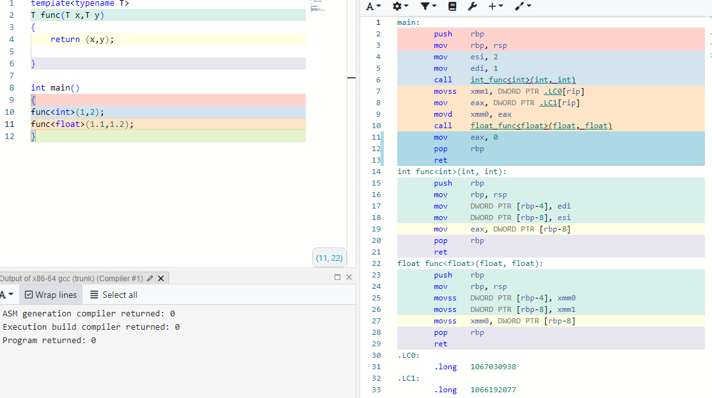

### 模版

模版是C++特有的非常神奇的功能,类似Java的泛型，它能避免编写重复相似的代码

**总结：**

​	**1.cpu对模版是无感的，模板本质上是编译器依据提供的脚本，自动补充的代码，涉及到的数据类型越多，代码的版本也就越多。**

**2.编译器自动补充的代码对程序员来说是不可见的，所以在单步调试的时候会出现源代码无法一一对应的问题，模版的相关代码往往只能进行黑盒测试，很难找到有效的调试办法。**

3.模版也会引入一些意外的编译问题

