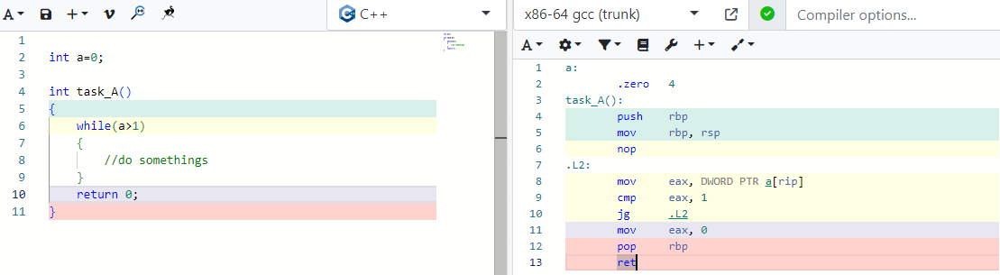
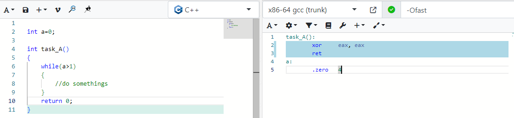

### volatile

对代码进行2级优化 -Ofast

....13条指令立马变成了5条，while循环都没有了，直接返回0，原来编译器会把变量a当常量来对待，既然是常量，那么a和1的比较结果是预先可知的，while条件不满足，显然可以不用执行，所以自然就被编译器优化掉了，这看上去也很合理，最后让我们给变量a加上修饰符volatile,有趣的事情发上了，while的三条指令有回来了

现在明白volatile的真正含义了嘛？易变不是讲给程序员听的，而是告诉编译器听的，原来编译器会把不会改变的变量当常量对待，以此换取大幅度的优化，缩减汇编指令，而volatile则是阻止这种优化，让CPU老老实实从内存中读写变量，

**结论：谨慎使用优化，或使用统一，一致的编译器，并确保各个软件版本的优化等级一致就显的非常必要了。**