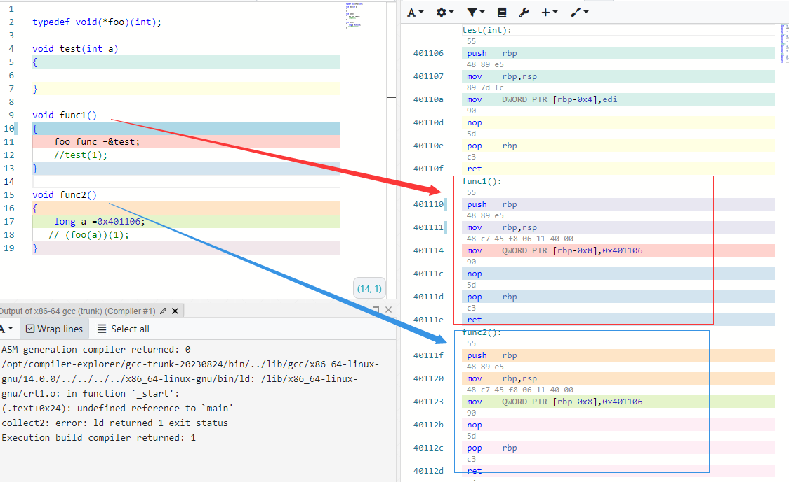
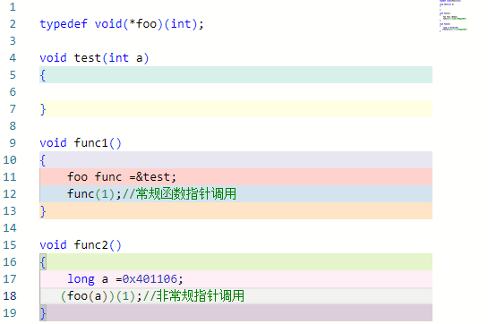
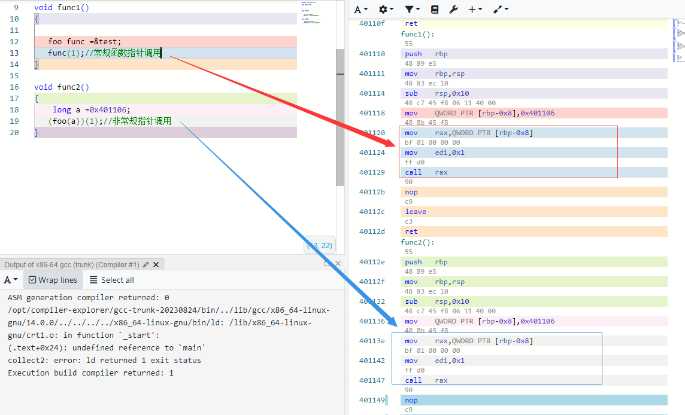

### 函数指针

定义一个最简单的函数指针类型，和一个与之对应的test函数，然后写一个简单的函数1做一下赋值，最后，写一个更简单的函数2，做一个普通变量的赋值，貌似函数1函数2没有任何相同点。



两个函数的汇编代码完全相同，所以可以肯定的是两个函数都是在做一件同样的事情：都是在把0x401106,存放在一个临时的栈变量里面，函数指针和普通变量一样，它依然是变量，对函数指针的赋值和对变量的赋值，在CPU眼里，它们之间，没有任何区别，在右侧的汇编代码中可以看到0x401106这是函数test的内存首地址，所以函数指针不是用来做运算的，而是用来存放内存地址得，只不过，指针变量往往用来存放某个变量的地址，而函数指针往往用来存放某个函数地址，一旦知道了函数首地址，我们就可以做函数调用了，函数调用就是cpu跳转到：某个函数的首地址，继续执行，但仅仅知道函数的首地址，是不够的，因为主调函数还需要为被调函数准备参数，如何知道：函数指针需要几个参数，需要什么类型的参数呢？就是预先定义的指针类型

```
typedef void(*foo)(int);
```

它告诉我们，调用这个函数指针的时候需要为它准备一个int类型的参数。至此，整个函数指针的运作条件就都具备了，让我们做一下函数调用吧



如你所见，通过简单的类型转换，普通变量，也可以化身为函数指针，进行函数调用



两者的汇编代码完全一致，似乎把函数指针叫做函数类型的变量似乎更加清晰一点，如上述测试，除了它存储的数据在用途上有所不同，它的实现机制跟一般变量，指针变量，非常相似。

**总结：**

​	**1.函数指针和普通指针变量一样都是用来存储内存地址，指针变量往往存放着：某个变量的内存首地址，而函数指针往往存放着：某个函数的内存首地址，当然，用普通变量存放：变量，或函数的地址也是可以的，但不提倡。**

**2.普通变量因为用法，字节长度的不同，需要定义不同的变量类型，函数也不例外，因为参数，返回值的不同，也需要事先定义相应类型的函数指针，从而帮助主调函数正确的给函数指针传递参数，和获取返回值。**

**3.传递函数指针，求实就是在传递某个函数的内存首地址，谁能得到某个函数的内存地址，就能随时调用这个函数。**

**4.函数指针虽然灵活，但无法直接看出它在调用哪个函数，因此，函数指针会损害程序的可读性，随着函数指针的增多，程序的维护成本，也会越来越高。最后，无论是普通变量，指针变量，还是函数指针，它们都是变量，某个内存地址的别名，只是因为数据本身的用途不同，做了细分。**

透过繁华，看清本质，能减少不必要的语法记忆