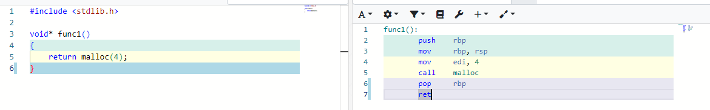
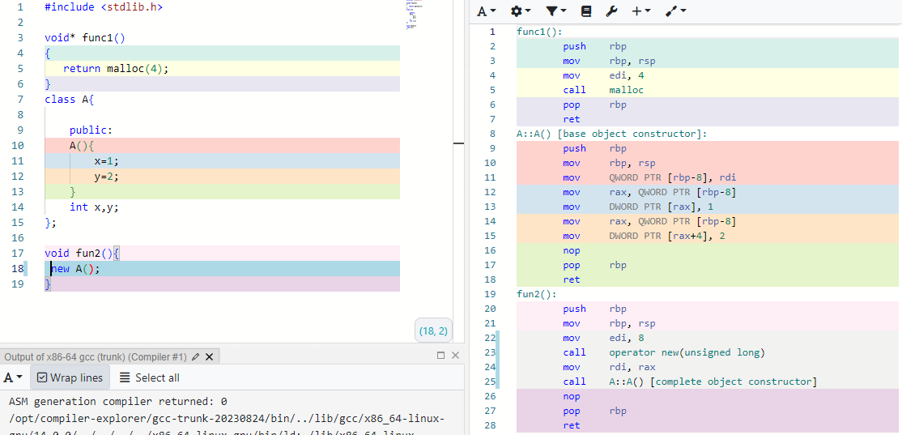
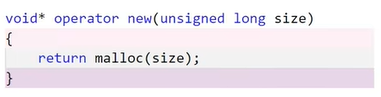

### malloc vs new

先写一个简单的malloc测试函数：



第一条指令，把数值4赋给寄存器edi,很显然：这是为后面的函数调用，准备参数，第二条指令就是调用函数malloc,结合传入的参数4，我们可以很容易猜出，这是要申请一个4字节大小的内存块，这样看来malloc是一个非常单纯的函数，输入所需内存的大小，它就可以帮我们申请相应大小的内存块，让我们再看看malloc的同门兄弟：new

先编写一个最简单的类：A,然后写一个简单的函数用来申请一个类A的对象



虽然new只有一行代码，却生成了4条指令，它们除了样子怪了一点并没有什么过人之处，先看前两条指令：和调用malloc非常相似，第一条指令还是传递参数值8，因为类A仅有两个int类型的成员变量，所以类A的大小是8个字节，非常合理，然后就是调用一个operator new 的函数，如此逆天的名字，真的让人怀疑自己的知识储备，但在cpu眼里，它根本就不是一个名字，而是一个函数首地址而已，当然不是我们写的函数，而是操作系统提前为为我们预备好的内存分配函数，当然也可以自己重写这个函数，至此内存分配就完成了



如果是malloc，就可以收工了，但new可不行，别忘了，类对象是需要初始化的，就是要调用构造函数，所以剩下的两条指令也很好解释了，第三条指令就是传递this指针

```
 mov     rdi, rax
```

第四条就是调用类A的构造函数，

真不愧是C++,如此简单的一个单词，竟然包含如此多的信息。

同上，我们可以很容易的猜出：free和delete之间的差异，

free是malloc的反向操作，也是一个纯函数接口，不过它的用途不是申请内存，而是释放，归还刚才申请的内存，


同样delete是new的反向操作，包含两个操作，首先调用类A的析构函数，然后就可以释放，归还类A对象所占据的内存空间。

**总结**

**1.malloc和free都是单纯的函数，用来申请和归还内存。**

**2，new包含了两个操作，第一个操作和malloc类似，也是申请内存，第二个操作也就是对类A的对象进行初始化，就是调用类A的构造函数，至于delete则正好相反，**

**3.无论是malloc和new,它们都是可以被“重载”的。**

**4.系统提供的malloc和new都会从堆上申请内存，但如果自己重载了malloc和new，那到底从哪里申请内存，就全靠自己把握了。**
