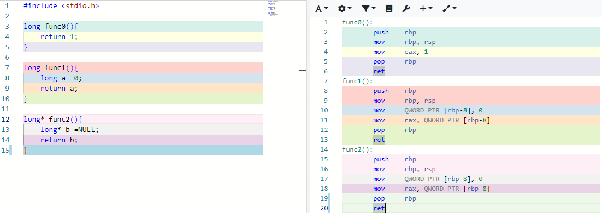
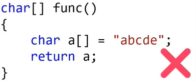
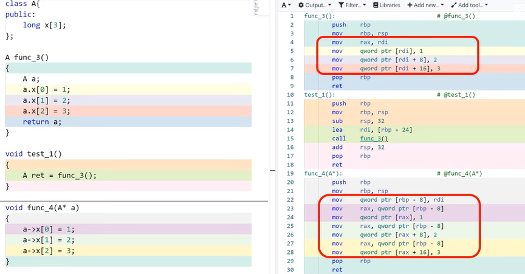

### 返回值，语言的硬伤

先写一个返回立即数的函数，在写一个返回普通变量的函数，再写一个返回指针变量的函数

如你所见返回普通变量的函数和返回指针变量的函数它们的cpu指令完全相同，这也是再一次告诉我们，指针变量和普通变量没有本质区别。它们都不约而同的分别把变量a,b的值，写入到寄存器rax,都是在用寄存器rax向主函数传递：返回值，如果一直这么清晰明了那该多好，可惜硬伤还是来了，或许你也发现了，这两个函数的返回值分别是8字节的变量a和8字节的内存地址，这对8字节的寄存器rax都是可以放下的，如果返回的是一个超过8字节的复杂数据，那还能用rax来放返回值吗？如下图返回一个数组，编译器会百般阻挠

这几乎阉割了函数输出这个重大功能，还好有一个变通的办法，

看到这里或许你坐不住了，因为返回临时对象是编码大忌，其实这里 并没有返回临时对象，函数3和函数4的指令其实是等价的，当然尽管这种返回临时对象的方法，是安全的。本质上还是利用指针，把用于存放输出结果的变量，提前导入到函数里面，但挑战大家的编码习惯，和代码约定，无疑是得不尝试的。

**总结：**

**1，对于返回原生数据类型（int,short,long）和指针，引用类型时，往往会使用rax寄存器，向主调函数传递返回值，**

**2，对于返回复杂数据类型，例如结构体，类对象，数组，字符串时，则需要避免返回栈变量和栈对象，往往需要开发者提前预留，或申请内存，用于保存函数的返回结果，**

**3.返回值问题的本质还是内存的问题，由于C/C++缺乏自动的内存回收和管理机制，所以在返回数据时，需要对数据的生命周期有精确严密的控制。**

