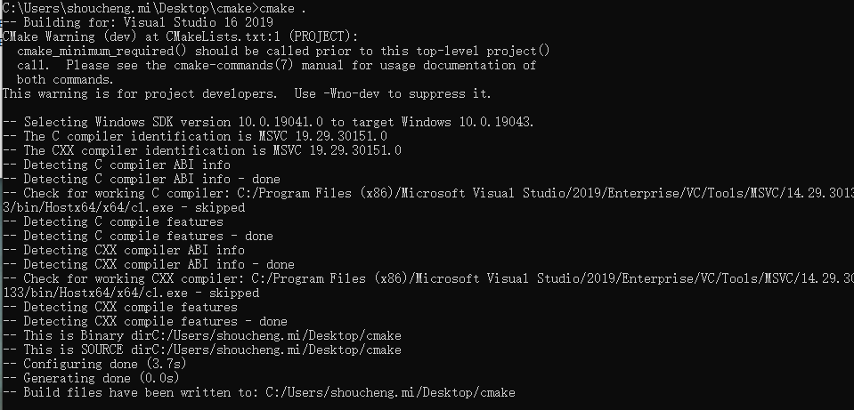
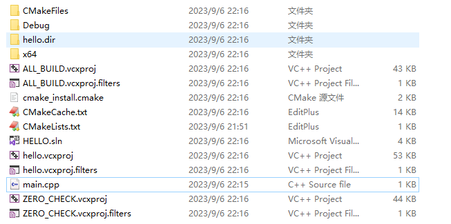
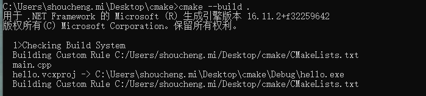
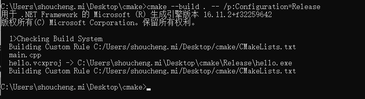

## cmake说明

cmake是高级编译配置工具。

当多人使用不同语言或者编译器开发一个项目，最终要输出一个可执行文件或者共享库（.dll,so等等），这时候神器就出现了-----cmake!

所有操作都是通过编译cmakelists.txt来完成的--操作简单。

官方网站 www.cmake.org .

## cmake一个helloworld!

```
#include <iostream>

int main()
{
	std::cout<<"hello world!!"<<std::endl;
}
```

运行cmake 命令：

```
cmake .
```



会生成相关的vs文件。



**接下来编译工程（默认Debug模式）**



**Release模式：**

```
cmake --build . -- /p:Configuration=Release
```



